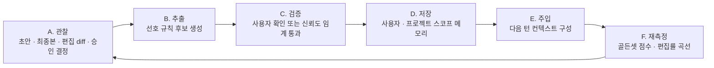
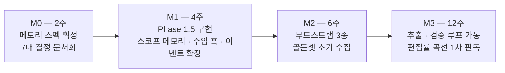

# Naby 개인화 전략 기획서 — 제품의 심장을 다시 정의한다

> **스펙 연동** — 이 전략 문서(design)가 상위 축을 정의하고, 아래 두 문서로 실행이 내려간다:
> - Phase 1.5 태스크·수용기준 → [`phase-1_5-personalization-data-layer`](../impl/phase-1_5-personalization-data-layer.md) (impl)
> - 스코프 메모리 스키마·주입·쓰기 게이트 계약 → [`phase-1_5-memory-contracts`](../interface/phase-1_5-memory-contracts.md) (interface)
> - 제품 전반 설계·로드맵 → [`personalized-agent-desktop-app`](personalized-agent-desktop-app.md) §5에 Phase 1.5가 편입됨.
>
> v1.0 서비스기획서(`naby-서비스기획서.md`, 사내 환경·거버넌스 축)는 폐기하지 않으며 **상위 축만 개인화로 교체**한다. 본 문서 §9의 미해결 결정(암호화·소유권 정책·기성 메모리 계층 채용)은 각 실행 문서에 **open question**으로 승계되어 있고, 여기서 임의로 확정하지 않는다.

> 이 문서가 답하는 질문 — **"점점 나에게 맞춰지는 에이전트"를 실제로 만들려면, 지금 무엇이 빠져 있고 무엇을 먼저 해야 하는가?**

**문서 정보** · 작성일 2026-07-22 · 버전 v1.1 · 대상 독자: 프로젝트 오너 및 설계 담당 · 상태: Review

**이전 문서와의 관계** · `naby-서비스기획서.md`(v1.0)는 축을 **사내 환경·거버넌스**에 두었음. 본 문서는 오너 의도에 맞춰 축을 **개인화**로 옮기고, v1.0의 결론 중 유효한 것은 승계, 우선순위가 바뀌는 것은 명시적으로 교체함. v1.0을 폐기하지 않으며 **상위 축만 교체**함.

**핵심 전제** · Phase 1은 목적이 아니라 전제조건임. 제품 가치는 Phase 2에서 메모리가 쌓이며 발생함.

---

## 요약 (Executive Summary)

- **관점 전환** — Phase 1을 "멀티 LLM 앱"으로 보면 이 프로젝트는 흔한 래퍼(wrapper)임. **"내 컨텍스트를 특정 벤더 밖에 축적하기 위한 전제조건"** 으로 보면 전략적 선택이 됨.
- **가장 중요한 발견** — 저장소 실사 결과, `memory` 테이블은 `PRIMARY KEY (session_id, key)` 로 **세션 단위 키-값 저장소**이며, 턴 실행 경로(`session.ts`)는 메모리를 **읽지도 쓰지도 않음** [1]. 즉 **개인화를 담을 자료구조와 주입 경로가 아직 없음.** Phase 1이 "단순 멀티 LLM 앱"으로 느껴지는 정확한 원인임.
- **두 번째 발견** — 스펙 전반이 개인화를 **측정**(승인율·편집거리·오버라이드율·LLM 채점)까지만 정의하고, 그 측정값이 다음 초안 생성으로 **되먹임되는 경로가 없음** [1][2]. 계기판은 있고 조향 장치가 없는 상태임.
- **학술 근거** — 사용자의 편집을 잠재 선호로 학습해 **이후 편집량을 줄이는 것**을 목적함수로 삼는 연구 계열이 이미 존재함(PRELUDE, NeurIPS 2024) [3]. 현재 스펙의 편집거리는 **지표이자 손실함수**로 재정의되어야 함.
- **컨셉 재정의** — **"안전을 위해 누른 승인 버튼이, 그대로 개인화 학습 신호가 된다."** 승인 게이트는 통제 장치이자 최고 품질의 선호 라벨 수집기임. 이 이중성이 이 제품의 구조적 강점임.
- **차별점** — 2026년 주요 어시스턴트는 모두 메모리를 탑재했으나, 각 벤더의 메모리는 **자사 제품 안에 사용자를 붙잡아 두는 리텐션 장치**이며 상호 이식이 되지 않음 [6][8]. Naby의 방어 가능한 자산은 **기억의 소유권과 이식성**임.
- **권고** — 기능 추가 전에 **Phase 1.5(개인화 데이터 계층)** 를 신설할 것. 사용자·프로젝트 스코프 메모리, 선호 추출·주입 경로, 메모리 쓰기 게이트, 골든셋 평가셋 4가지가 없으면 Phase 2는 착수해도 학습할 재료가 없음.

---

## 1. 배경 및 문제정의

### 1.1 관점 전환 — 무엇이 바뀌었나

| 항목 | v1.0 기획서 관점 | 본 문서 관점 |
|---|---|---|
| 제품의 심장 | 승인 게이트 = 통제 자산 | **개인화 루프** = 가치 발생 지점 |
| Phase 1의 의미 | 사내 배포 가능한 셸 | **개인화 자산을 벤더 밖에 두기 위한 전제조건** |
| 승인 게이트의 역할 | 안전장치 | 안전장치 **+ 선호 라벨 수집기** |
| 멀티 프로바이더의 의미 | 벤더 협상력 | **기억의 이식성 — 모델을 바꿔도 내가 남는다** |
| 성공 판정 | 사용자 수·온보딩 성공률 | **편집률 감소 곡선** |

- v1.0의 사내 배포·거버넌스 논리는 유효하며 폐기하지 않음. 다만 **그것은 개인화를 안전하게 축적하기 위한 조건**이지 목적이 아님.

### 1.2 코드가 말해주는 현실

저장소 실사에서 확인한 사실(2026-07-22 `main` 기준) [1].

- **메모리 스키마** — `memory(session_id, key, value)`, 기본키는 `(session_id, key)`. 즉 **세션이 끝나면 사실상 끝나는 메모리**임.
- **키잉 불변식** — 계약 문서 §6은 "메시지·메모리·사용량은 오직 `sessionId`로만 키잉된다"를 불변식으로 못박음. 프로젝트는 링크일 뿐 키가 아님.
- **연쇄 삭제** — 프로젝트를 지우면 그 하위 세션의 메시지·메모리·사용량이 함께 삭제됨.
- **주입 경로 부재** — 턴을 실행하는 `runTurn`에 메모리 조회·주입 코드가 없음.
- **문서상 위치** — 설계도에 "Memory / context / personalization store"라는 **박스는 있으나**, 무엇을 담고 어떻게 쓰고 언제 지우는지에 대한 명세는 없음.

> 비유 — 지금 상태는 도서관 건물을 짓고 서가까지 세웠는데, **책을 어떻게 수집·분류·대출·폐기할지에 대한 규정이 없는 것**과 같음. 건물이 잘못된 게 아니라, 운영 규정이 아직 없는 것임.

### 1.3 문제 정의

> **"제품 이름에는 '개인화 에이전트'가 들어 있지만, 개인화를 축적할 자료구조·학습 경로·평가 방법이 아직 정의되지 않았다. 이대로 Phase 2에 진입하면 측정만 하고 학습하지 않는 에이전트가 된다."**

---

## 2. 목적 및 목표

### 2.1 개인화의 3층 정의

현 스펙의 개인화는 사실상 **문체 일치도**에 수렴함("얼마나 나답게 썼는가", persona_score) [1][2]. 그러나 "내 업무를 돕는" 개인화는 세 층으로 나뉘며, 층마다 난이도와 가치가 다름.

| 층 | 내용 | 예시 | 획득 난이도 | 업무 기여 |
|---|---|---|---|---|
| **L1 문체(Voice)** | 어투·길이·포맷 | "불릿 3개, 존댓말, 결론 먼저" | 낮음 — 프롬프트 몇 줄로도 상당 부분 해결 | 낮음 |
| **L2 선호·규칙(Preference)** | 판단 기준, 반복 절차 | "이 고객사엔 가격 먼저 말하지 않는다", "회의록은 결정·액션·보류로 나눈다" | 중간 — 반복 관찰 필요 | **높음** |
| **L3 맥락·관계(Context)** | 진행 중 일, 사람, 조직 용어 | "A 프로젝트는 지난주에 범위가 축소됐다", "이 약어는 사내 전용" | 높음 — 지속 축적·갱신 필요 | **매우 높음** |

- **전략적 결론** — 경쟁 도구가 이미 잘하는 영역은 L1임. **우리가 이겨야 하는 곳은 L2·L3이며, 이는 사내 배포 환경에서 훨씬 유리함**(같은 업무 반복, 공유 용어, 팀 단위 규칙).
- 현 지표 체계는 L1에 최적화되어 있으므로, §2.2에서 재정의함.

### 2.2 북극성 지표 — 편집률 감소 곡선

- **정의** — 동일 태스크 유형 안에서, 사용 기간이 늘어남에 따라 **초안 대비 최종본의 편집량이 줄어드는 추세**.
- **근거** — 사용자 편집으로부터 잠재 선호를 학습하는 연구는 **"이후의 편집 비용을 줄이는 것"** 자체를 목적함수로 삼음 [3]. 우리 편집거리는 대시보드용 숫자가 아니라 **최적화 대상**임.
- **주의 — 이 지표는 단독으로 쓰면 거짓말을 함.** 개인화가 좋아지면 사용자는 **더 어려운 일을 맡기기 시작**하고, 그 순간 편집거리는 다시 올라감. 태스크 난이도가 교란 변수임.
- **해법** — 고정 평가셋(골든셋)을 병행함(§4.4).

**보조 지표**

- **메모리 적중률** — 주입된 메모리 항목 중 실제 산출물에 반영·인용된 비율. 낮으면 검색 전략이 잘못된 것임.
- **메모리 정정률** — 사용자가 메모리를 수정·삭제한 비율. **높으면 나쁜 게 아니라 신뢰 신호**임(사용자가 들여다본다는 뜻). 0에 가까우면 아무도 신뢰하지 않거나 존재를 모르는 것임.
- **승인율·오버라이드율** — 기존 정의 유지 [1].
- **반증 지표** — 메모리 오작동 신고 건수, 잘못된 개인화로 인한 재작업 건수.

### 2.3 비목표

- 파인튜닝·모델 학습 — 개인화는 **컨텍스트 구성**으로 달성함. 사용자별 파인튜닝은 비용·운영 모두 이 단계에 부적합.
- 학술 벤치마크 점수 경쟁 — §4.4에서 근거를 제시함.
- 완전 자동 메모리 — 사용자가 열람·수정·삭제할 수 없는 메모리는 만들지 않음.

---

## 3. 핵심 컨셉과 전략

### 3.1 컨셉 한 문장

> **"안전을 위해 누른 승인 버튼이, 그대로 나를 학습시키는 신호가 된다 — 그리고 그 학습 결과는 모델을 바꿔도 내 것으로 남는다."**

- 앞 절반은 **HITL 게이트의 재정의**임. 승인·수정·거부는 사용자가 **일부러 만들어 준 고품질 선호 라벨**임. 별도 피드백 UI를 붙일 필요가 없다는 점이 구조적 이점임.
- 뒤 절반은 **멀티 프로바이더의 재정의**임. 5개 프로바이더는 기능 자랑이 아니라, 축적된 개인화 자산이 특정 벤더에 묶이지 않게 하는 **소유권 장치**임.

### 3.2 개인화 루프 — 지금 없는 것

* 자료: 자체 작성. 현 스펙 대응 관계는 아래 표 참조

| 단계 | 현 스펙 상태 | 판정 |
|---|---|---|
| A. 관찰 | F2-04 평가 이벤트 로거로 정의됨 [1] | ✅ 있음 |
| B. 추출 | 없음 | ❌ **공백** |
| C. 검증 | 없음 | ❌ **공백** |
| D. 저장 | 세션 스코프 KV만 존재 [1] | ⚠️ 구조 부적합 |
| E. 주입 | 코드·스펙 모두 없음 [1] | ❌ **공백** |
| F. 재측정 | F2-05 대시보드, F2-07 LLM 채점 [1] | ⚠️ 측정만, 난이도 통제 없음 |

- **핵심 진단** — 루프의 6단계 중 **3개가 완전 공백, 2개가 부적합**임. 이것이 "Phase 2에 개인화 에이전트가 붙는다"는 계획과 현재 설계 사이의 실제 거리임.

### 3.3 차별점 — 기억의 소유권과 이식성

**2026년 시장 상황.** 주요 어시스턴트는 이미 전부 메모리를 탑재함 — 복수 비교 매체 보도 기준, ChatGPT는 배경에서 메모리를 정리·갱신하는 기능을, Claude는 전 요금제 대상 대화 메모리를, Gemini는 Personal Intelligence를, Microsoft 365 Copilot은 메모리 롤아웃을 각각 2026년 상반기에 전개함 [6][8]. *(개별 기능의 정확한 명칭·출시일은 각 벤더 공식 문서로 재확인 필요.)*

**그런데 공통 한계가 있음.**

- 모든 어시스턴트가 **세션 간 기억은 되지만, 다른 AI로는 넘어가지 않음.** 각 벤더의 메모리는 자사 제품 리텐션 장치로 설계되었기 때문임 [6].
- 저장 방식도 갈림 — 일부는 불투명한 벡터 기반, 일부는 사람이 읽을 수 있는 텍스트 파일 기반이며, **투명성 자체가 제품 차별점**이 되는 국면임 [7].
- 이식 시도는 시작되었으나 아직 임시방편 수준이며, **메모리 이식성이 새로운 경쟁 전선**이 되고 있음 [7][8].

**따라서 Naby의 포지션은 명확함.**

| 축 | 벤더 내장 메모리 | Naby |
|---|---|---|
| 저장 위치 | 벤더 서버 | **로컬 `app.db` — 우리 소유** [1] |
| 모델 교체 시 | 기억 소실 | **유지 — 프로바이더 비의존 런타임** [1] |
| 열람·수정·삭제 | 제한적 | 설계 가능(그렇게 설계해야 함) |
| 조직 통제 | 벤더 정책에 종속 | 사내 정책으로 통제 |
| 학습 신호 | 대화 위주 | **승인·편집이라는 고품질 라벨** |

- 이 표의 오른쪽 열은 **현재 사실이 아니라 설계 목표**임. 2·4행만 이미 확보되어 있고 나머지는 §4에서 만들어야 함.

---

## 4. 실행 방안

### 4.1 메모리 아키텍처 — 결정해야 할 7가지

메모리를 1급 설계 대상으로 승격하고, 아래 7가지를 스펙 문서로 확정할 것을 제안함.

- **결정 1 · 스코프 계층화** — 현재의 세션 스코프를 4계층으로 확장.
  - 사용자(user) — 문체·일반 선호. 세션·프로젝트를 가로지름.
  - 프로젝트(project) — 해당 업무의 맥락·용어·이력. `projects` 테이블이 이미 있어 연결 지점 존재 [1].
  - 세션(session) — 현재 대화의 작업 상태. 지금 구조 유지.
  - 조직(org, 선택) — 팀 공용 규칙·용어집. 사내 배포에서만 성립하는 자산.
- **결정 2 · 메모리 유형 분리** — 업계 통용 분류인 작업(working)·일화(episodic)·의미(semantic)·절차(procedural)를 채택하고, 계층형 관리 패턴을 참조 [14]. 유형별로 보존 기간과 주입 우선순위가 달라야 함.
- **결정 3 · 쓰기 주체와 승인** — 자동 추출을 기본으로 하되, **사용자 확인을 거친 항목과 자동 추출 항목을 구분 저장**. 신뢰도 임계 이하는 "제안" 상태로 보류.
- **결정 4 · 메모리 쓰기 게이트** — §7.1 참조. **도구 실행만 게이트하고 메모리 쓰기를 게이트하지 않으면 구멍이 남음.**
- **결정 5 · 주입 전략과 토큰 예산** — 전량 주입은 비용·지연·정확도 모두에서 실패함. 검색 기반 주입 + 턴당 토큰 예산 상한을 정할 것. 연구 결과상 **맥락별 예시를 검색해 붙이고, 생성 전에 선호를 별도로 추론하는 2단 구성**이 편집 비용을 가장 크게 낮췄음 [3].
- **결정 6 · 갱신·충돌·망각** — 선호는 변함. 기존 메모리 벤치마크가 "저장된 정보는 계속 유효하다"고 암묵 가정하는 것이 바로 약점으로 지적됨 [4]. 갱신 규칙(최신 우선/명시적 폐기), 충돌 해소, 만료 정책이 필요함.
- **결정 7 · 출처 추적(provenance)** — 각 메모리 항목에 "언제·어느 세션·어떤 근거로 만들어졌는가"를 기록. 사용자 열람·삭제 UI와 오염 사고 시 역추적의 전제 조건임 [9].

### 4.2 Phase 재배치 — Phase 1.5 신설 제안

| 단계 | 기존 계획 | 제안 |
|---|---|---|
| Phase 1 | 셸·엔진·프로바이더·세션 [1] | 유지 |
| **Phase 1.5** | 없음 | **개인화 데이터 계층 — 신설** |
| Phase 2a | 도구·게이트·가드레일·지표 [1] | 유지 + 이벤트 스키마 확장 |
| Phase 2b | LLM 채점 [1] | 유지 + **추출·주입 루프 추가** |

**Phase 1.5 최소 범위 (4개 항목)**

| ID | 항목 | 완료 기준 |
|---|---|---|
| P15-01 | 사용자·프로젝트 스코프 메모리 테이블 + 출처 필드 | 세션 삭제가 사용자 메모리를 지우지 않음 |
| P15-02 | 턴 실행 경로의 메모리 조회·주입 훅 | 주입된 항목이 로그에 남고 토큰 예산 준수 |
| P15-03 | 이벤트 스키마 확장 — 태스크 유형·도메인 태그·편집 diff | 태스크 유형별 편집거리 집계 가능 |
| P15-04 | 골든셋 수집 동의 및 저장 구조 | 사용자당 홀드아웃 N건 확보 |

- **왜 지금인가** — 이 4가지는 **데이터를 만드는 장치**임. 지금 심지 않으면 Phase 2 착수 시점에 학습할 과거 데이터가 0이 되어, 개인화 검증이 통째로 몇 달 밀림.
- 규모는 크지 않음. 스키마 확장과 훅 추가가 대부분이며, 저장소 계약(`Store` 인터페이스)이 이미 명확히 분리되어 있어 접합점이 존재함 [1].

### 4.3 콜드스타트 부트스트랩

새 사용자는 개인화 데이터가 0이며, 첫 2주가 이탈 구간임. 세 가지 경로를 병행 제안함.

- **경로 A · 기존 산출물 임포트** — 사용자가 과거에 쓴 문서·메일·커밋 메시지 일부를 임포트해 초기 문체·선호를 추정. 작성 샘플로부터 선호를 예측하는 접근이 연구로 존재함 [15].
- **경로 B · 온보딩 인터뷰** — 10문항 내외의 구조화 질문으로 L1·L2 시드를 확보. 사용자가 명시적으로 답한 항목은 신뢰도 최상위로 저장.
- **경로 C · 팀 페르소나 상속** — 사내 배포의 고유 이점. 조직 스코프 메모리(용어집·문서 양식·업무 규칙)를 신규 사용자에게 기본 제공. **개인 데이터 0인 상태에서도 즉시 유용**해짐.

- 경로 C가 사내 배포와 개인화가 만나는 지점임. 시장 제품은 조직 공용 컨텍스트를 이렇게 쉽게 확보하지 못함.

### 4.4 평가 설계 — 골든셋

**학술 벤치마크를 그대로 쓰면 안 되는 이유.**

- 메모리 평가의 표준으로 통용되는 LoCoMo·LongMemEval·BEAM은 다중 세션 회상을 다룸 [5]. 그러나 최근 연구는 **LoCoMo 문항의 94%, LongMemEval 문항의 85%가 직전 2개 세션 이내의 근거만으로 답이 되며**, 결과적으로 대부분의 평가가 "누적된 정보의 종합"이 아니라 "이전 세션의 특정 정보 회상"으로 축소된다고 지적함 [4].
- 즉 이 벤치마크들은 **"오래 쓸수록 나에게 맞춰지는가"를 측정하지 못함.** 원래 계획서가 "학술 메모리 벤치는 '나답게'를 못 잰다"고 판단한 것은 옳았고 [2], 실제로는 그보다 더 근본적인 한계가 있음.

**대안 — 사용자별 골든셋.**

- 구성 — 사용자의 실제 과거 산출물 중 N건을 **학습에서 제외**하고 보관.
- 측정 — 메모리가 쌓일 때마다 동일 입력으로 재생성해 골든셋과의 거리를 비교. 사용량·태스크 난이도와 무관하게 **개인화 진척만** 분리 측정됨.
- 채점 — 결정론 지표(편집거리)와 LLM 채점(2b)을 병기하되, **채점 모델은 생성 모델과 다른 프로바이더**를 쓸 것. 멀티 프로바이더 구조의 실질적 이점이며 스펙에도 이미 언급되어 있음 [1].
- 주기 — 주 1회 배치. 전송 경로 밖(비동기)이라는 기존 원칙 유지 [1][2].

---

## 5. 일정 / 마일스톤

* 자료: 자체 작성. T-shirt 추정이며 착수 시 재산정 필요

- **M3가 이 프로젝트 최초의 진짜 판정 시점**임. 그전까지는 "개인화가 되는지"를 말할 수 없음.
- 판정 기준(제안) — 동일 태스크 유형에서 4주 사용 후 편집거리 중앙값이 **유의미하게 감소**하고, 골든셋 점수가 상승할 것.

---

## 6. 기대효과

- **사용자 관점** — 재설명 비용의 감소. 사용자가 매 대화마다 맥락을 다시 설명하는 낭비가 개인화의 1차 제거 대상임 [8].
- **조직 관점** — 팀 페르소나 상속으로 신규 입사자의 온보딩 컨텍스트가 자산화됨. 이는 v1.0이 말한 "사업개발 인사이트"의 가장 구체적인 형태임.
- **제품 관점** — 편집률 감소 곡선이 실제로 그려지면, 그 곡선 자체가 **파생 사업의 핵심 증거**가 됨. 도구를 파는 것이 아니라 "개인화가 실제로 일어난다"는 데이터를 갖게 됨.
- **전략 관점** — 모델 교체 비용이 낮아짐. 축적 자산이 벤더 밖에 있으므로 프로바이더 가격·정책 변화에 종속되지 않음 [1][6].

---

## 7. 리스크 및 대응

### 7.1 메모리 오염 — 최우선 리스크

- **성격** — 프롬프트 인젝션은 세션이 끝나면 사라지지만, **메모리 오염은 남음.** 공격과 피해가 시간적으로 분리되어 몇 주 뒤에 발현될 수 있음 [10].
- **업계 인식** — OWASP는 2026년 에이전틱 AI 상위 위험 목록에 **메모리·컨텍스트 오염(ASI06)** 을 별도 항목으로 추가함 [9][10]. 세션 단위 방어(입력 검열·출력 필터링)로는 잡히지 않기 때문임 [9].
- **실증** — 질의만으로 에이전트 장기 메모리를 오염시키는 공격이 높은 성공률로 보고되었고 [12], 상용 에이전트 메모리에 대한 간접 인젝션 실증도 공개됨 [11].
- **대응 — 메모리 쓰기 게이트 신설.**
  - 원칙 — 도구 실행이 게이트를 통과하듯, **메모리 쓰기도 통과해야 함.** 현 스펙의 게이트는 도구 호출만 대상으로 함 [1].
  - 신뢰 등급 — 사용자 발화 유래 > 산출물 유래 > **외부 콘텐츠(웹·메일·문서) 유래**. 외부 유래는 자동 저장 금지, 사용자 확인 필수.
  - 출처 추적 — 결정 7과 동일. 사고 시 해당 출처의 메모리만 선택 폐기 가능해야 함.
  - 정기 열람 — 사용자가 자기 메모리를 통째로 볼 수 있는 화면이 방어의 마지막 층임.

### 7.2 그 외 리스크

| 리스크 | 수준 | 대응 |
|---|---|---|
| 나쁜 습관까지 학습 | 중간 | 메모리 편집 UI, 규칙별 활성/비활성 토글 |
| 개인화 과적합 — 새 상황에서 경직 | 중간 | 주입 예산 상한, 태스크 유형별 스코프 분리 |
| 메모리 소유권 — 퇴사·인사이동 | 높음 | 사용자 스코프와 조직 스코프 분리 저장, 반출·삭제 정책 사전 수립 |
| 초안·최종본 평문 저장 | 높음 | `app.db` 암호화 여부는 스펙에도 미해결로 남아 있음 [1]. 개인화가 핵심이면 **더 이상 미룰 수 없는 결정**임 |
| 검색 품질 저하 시 무용화 | 중간 | 메모리 적중률 지표로 조기 감지 |
| 자체 구현 부담 | 중간 | Mem0·Zep·Letta 등 기성 메모리 계층 참조 또는 부분 채용 검토 [13][14]. 단, 로컬 소유 원칙과 충돌하지 않는 범위에서만 |

---

## 8. 사내 목적과의 결합

개인화 축으로 옮겨도 v1.0이 제시한 사내 도입 목적과 충돌하지 않으며, 오히려 **사내 배포가 개인화에 유리한 이유**가 드러남.

- **반복성** — 사내 업무는 같은 형식의 일이 반복됨. 개인화 학습에 필요한 동일 태스크 유형 표본이 빠르게 쌓임.
- **공유 용어** — 조직 스코프 메모리(용어집·양식·규칙)가 성립함. 시장 제품은 이 데이터를 얻지 못함.
- **데이터 이탈 없음** — 초안·최종본·선호가 사외로 나가지 않음. 섀도 AI 대안 제공이라는 v1.0의 논지와 정확히 맞물림.
- **인사이트 원천** — "어떤 업무 유형에서 개인화가 실제로 먹히는가"는 사내 데이터에서만 나옴. 이것이 2순위 목적의 실질 내용임.

**따라서 v1.0의 KPI 계층 C(인사이트)는 다음으로 구체화됨** — 분기별 산출물을 "사업 가설 카드 3건"에서 **"태스크 유형별 개인화 효과 곡선 + 그중 시장성이 보이는 유형 1건"** 으로 교체할 것을 제안함.

---

## 9. 의사결정 요청 사항

- **메모리 스코프 승격을 Phase 1.5로 신설할 것인가**, 아니면 Phase 2a에 흡수할 것인가. 신설을 권고함 — 데이터 축적 시작 시점이 늦어질수록 판정도 늦어짐.
- **메모리 쓰기 게이트를 Phase 1.5에 포함할 것인가.** 외부 콘텐츠를 읽는 도구가 붙는 시점 이전이어야 안전함.
- **`app.db` 암호화** — 개인화 데이터가 곧 개인 업무 내용이므로, 사내 정보 등급 정책과의 연동 판단 필요.
- **메모리 소유권 정책** — 퇴사·인사이동 시 사용자 스코프 메모리의 처리. 법무·인사 확인 필요.
- **기성 메모리 계층 채용 여부** — 자체 구현과 외부 라이브러리 사이의 선택. 로컬 소유·감사 가능성을 훼손하지 않는지가 판단 기준.

> [확인 필요: 메모리 소유권·개인정보 처리 판단은 법무 영역. 본 문서는 설계 관점의 쟁점 제기만 함.]

---

## 참고문헌

1. leonardo204(2026.7.22.), naby — 저장소 실사: `src/runtime/store/sqlite-store.ts`, `store.ts`, `session.ts`, `ref-docs/specs/**`, https://github.com/leonardo204/naby
2. 프로젝트 오너(2026.7.19.), 개인화 페르소나 에이전트 데스크톱 앱 — 빌드 계획서 v0.2 (본 대화 제공 문서)
3. Gao, Ge et al.(2024), Aligning LLM Agents by Learning Latent Preference from User Edits, NeurIPS 2024, https://arxiv.org/abs/2404.15269
4. arXiv(2026.4.), From Recall to Forgetting: Benchmarking Long-Term Memory for Personalized Agents — LoCoMo 94%·LongMemEval 85%가 2세션 이내 근거로 해결됨, https://arxiv.org/html/2604.20006v1
5. Mem0(2026.7.), AI Memory Benchmarks 2026: LoCoMo, LongMemEval & BEAM, https://mem0.ai/blog/ai-memory-benchmarks-in-2026
6. MemoryLake(2026.6.5.), AI Memory Compared 2026: ChatGPT vs Claude vs Gemini — 벤더 메모리의 비이식성, https://www.memorylake.ai/en/blogs/ai-memory-compared-2026
7. Glasp(2026.4.18.), AI Memory Wars — 저장 방식 차이와 이식성 경쟁, https://glasp.ai/articles/ai-memory-wars
8. MayhemCode(2026.7.), AI Memory Problem 2026 — 벤더별 메모리 출시 동향 및 컨텍스트 재설명 비용, https://www.mayhemcode.com/2026/07/ai-memory-problem-2026-risks-in-chatgpt.html
9. Vectorize(2026.6.10.), AI Memory Poisoning — OWASP ASI06 신설 배경, https://vectorize.io/articles/ai-memory-poisoning
10. Christian Schneider(2026.2.26.), Memory poisoning in AI agents: exploits that wait, https://christian-schneider.net/blog/persistent-memory-poisoning-in-ai-agents/
11. Unit 42, Palo Alto Networks(2025.10.9.), Indirect Prompt Injection Poisons AI Long-Term Memory, https://unit42.paloaltonetworks.com/indirect-prompt-injection-poisons-ai-longterm-memory/
12. Mem0(2026.3.23.), AI Memory Security: Best Practices — MINJA 공격 성공률, https://mem0.ai/blog/ai-memory-security-best-practices
13. Atlan(2026.4.2.), Best AI Agent Memory Frameworks in 2026, https://atlan.com/know/best-ai-agent-memory-frameworks-2026/
14. JobsByCulture(2026.6.5.), AI Agent Memory Systems: A 2026 Engineering Guide — 메모리 4유형과 계층 관리 패턴, https://jobsbyculture.com/blog/ai-agent-memory-systems-guide-2026
15. arXiv(2025.5.), Aligning LLMs by Predicting Preferences from User Writing Samples, https://arxiv.org/html/2505.23815
16. arXiv(2026.5.30.), Large Language Models Should Learn Personalized Rather Than Aggregated Human Preferences, https://arxiv.org/html/2606.07629

---

## 부록 — 실사 근거 및 미확인 사항

**직접 확인한 코드 사실 (2026-07-22 `main`)**

- `sqlite-store.ts` — `CREATE TABLE IF NOT EXISTS memory (session_id TEXT NOT NULL, key TEXT NOT NULL, value TEXT NOT NULL, PRIMARY KEY (session_id, key));`
- `store.ts` 주석 — "sessions, messages and memory are keyed by SESSION ID ONLY."
- `session.ts` — 메모리 조회·주입 관련 코드 없음.
- `phase-1-contracts.md` §6 — 메시지·메모리·사용량은 `sessionId`로만 키잉된다는 불변식 명시. 프로젝트 삭제 시 하위 메모리까지 연쇄 삭제.

**미확인 사항**

- 벤더별 메모리 기능의 정확한 명칭·출시일·요금제 적용 범위는 2차 매체 기준이며, **각 벤더 공식 문서로 재확인 필요** [6][8].
- 골든셋 방식의 사내 적용 가능성(개인 산출물 사용 동의 범위)은 인사·법무 확인 필요.
- 기성 메모리 프레임워크의 라이선스·자체 호스팅 조건은 채용 검토 시 개별 확인 필요 [13].
- 본 문서의 기간·수치(4주·N건 등)는 조직 규모 정보가 없어 **제안값**이며 착수 시 재설정 필요.
