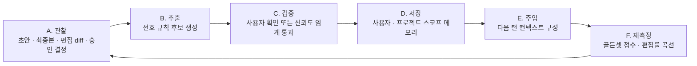
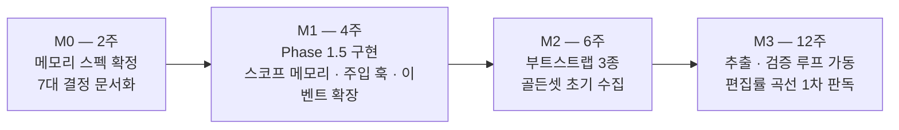

# Naby 개인화 전략 기획서 — 제품의 심장을 다시 정의한다

> **스펙 연동** — 이 전략 문서(design)가 상위 축을 정의하고, 실행은 아래 문서로 내려간다.
> - Phase 1.5 태스크와 수용 기준 → [`phase-1_5-personalization-data-layer`](../impl/phase-1_5-personalization-data-layer.md) (impl)
> - 스코프 메모리 스키마·주입·쓰기 게이트 계약 → [`phase-1_5-memory-contracts`](../interface/phase-1_5-memory-contracts.md) (interface)
> - 제품 전반 설계와 로드맵 → [`personalized-agent-desktop-app`](personalized-agent-desktop-app.md) §5에 Phase 1.5를 넣었다.
>
> **자매 전략** — [`harness-portability-strategy`](harness-portability-strategy.md). 이 문서가 *기억*의 소유권과 이식성을 다룬다면 그쪽은 *하네스*(스킬·서브에이전트·커맨드)의 소유권과 이식성을 다룬다. "모델을 바꿔도 내가 남는다"는 같은 명제의 두 축이다.
>
> v1.0 서비스기획서(`naby-서비스기획서.md`, 사내 환경과 거버넌스를 축으로 삼은 문서)는 폐기하지 않는다. **상위 축만 개인화로 바꾼다.** 이 문서 §9의 미해결 결정(암호화, 소유권 정책, 기성 메모리 계층 채용)은 각 실행 문서에 **open question**으로 넘겼고, 여기서 임의로 확정하지 않는다.

> 이 문서가 답하는 질문 — **"점점 나에게 맞춰지는 에이전트"를 실제로 만들려면 지금 무엇이 빠져 있고 무엇을 먼저 해야 하는가?**

**문서 정보** · 작성일 2026-07-22 · 버전 v1.1 · 대상 독자: 프로젝트 오너와 설계 담당 · 상태: Review

**이전 문서와의 관계** · `naby-서비스기획서.md`(v1.0)는 축을 **사내 환경과 거버넌스**에 두었다. 이 문서는 오너 의도에 맞춰 축을 **개인화**로 옮긴다. v1.0의 결론 중 유효한 것은 물려받고, 우선순위가 바뀌는 것은 바뀐다고 밝힌다. v1.0을 폐기하지 않고 **상위 축만 바꾼다.**

**핵심 전제** · Phase 1은 목적이 아니라 전제조건이다. 제품 가치는 Phase 2에서 메모리가 쌓이며 생긴다.

---

## 요약 (Executive Summary)

- **관점 전환** — Phase 1을 "멀티 LLM 앱"으로 보면 이 프로젝트는 흔한 래퍼(wrapper)다. **"내 컨텍스트를 특정 벤더 밖에 쌓기 위한 전제조건"** 으로 보면 전략적 선택이 된다.
- **가장 중요한 발견** — 저장소를 실사해 보니 `memory` 테이블은 `PRIMARY KEY (session_id, key)`라서 **세션 단위 키-값 저장소**이고, 턴 실행 경로(`session.ts`)는 메모리를 **읽지도 쓰지도 않는다** [1]. 개인화를 담을 자료구조와 주입 경로가 아직 없다는 뜻이다. Phase 1이 "그냥 멀티 LLM 앱"처럼 느껴지는 정확한 원인이다.
- **두 번째 발견** — 스펙 전반이 개인화를 **측정**하는 데까지만 정의했다(승인율, 편집거리, 오버라이드율, LLM 채점). 그 측정값이 다음 초안 생성으로 **돌아오는 경로가 없다** [1][2]. 계기판은 있고 조향장치가 없다.
- **학술 근거** — 사용자의 편집을 잠재 선호로 학습해 **이후 편집량을 줄이는 것**을 목적함수로 삼는 연구가 이미 있다(PRELUDE, NeurIPS 2024) [3]. 지금 스펙의 편집거리는 **지표이면서 손실함수**로 다시 정의해야 한다.
- **개념 재정의** — **"안전을 위해 누른 승인 버튼이 그대로 개인화 학습 신호가 된다."** 승인 게이트는 통제 장치이면서 가장 품질 좋은 선호 라벨 수집기다. 이 이중성이 이 제품의 구조적 강점이다.
- **차별점** — 2026년 주요 어시스턴트는 모두 메모리를 달았다. 그런데 각 벤더의 메모리는 **자사 제품 안에 사용자를 붙잡아 두는 장치**이고 서로 옮길 수 없다 [6][8]. Naby가 지킬 수 있는 자산은 **기억의 소유권과 이식성**이다.
- **권고** — 기능을 더하기 전에 **Phase 1.5(개인화 데이터 계층)** 를 새로 둔다. 사용자·프로젝트 스코프 메모리, 선호 추출과 주입 경로, 메모리 쓰기 게이트, 골든셋 평가셋 네 가지가 없으면 Phase 2는 시작해도 학습할 재료가 없다.

---

## 1. 배경과 문제정의

### 1.1 관점 전환 — 무엇이 바뀌었나

| 항목 | v1.0 기획서 관점 | 이 문서의 관점 |
|---|---|---|
| 제품의 심장 | 승인 게이트 = 통제 자산 | **개인화 루프** = 가치가 생기는 지점 |
| Phase 1의 의미 | 사내에 배포할 수 있는 셸 | **개인화 자산을 벤더 밖에 두기 위한 전제조건** |
| 승인 게이트의 역할 | 안전장치 | 안전장치 **+ 선호 라벨 수집기** |
| 멀티 프로바이더의 의미 | 벤더 협상력 | **기억의 이식성 — 모델을 바꿔도 내가 남는다** |
| 성공 판정 | 사용자 수·온보딩 성공률 | **편집률 감소 곡선** |

- v1.0의 사내 배포와 거버넌스 논리는 그대로 유효하니 폐기하지 않는다. 다만 **그것은 개인화를 안전하게 쌓기 위한 조건**이고 목적은 아니다.

### 1.2 코드가 말해주는 현실

저장소 실사에서 확인한 사실이다(2026-07-22 `main` 기준) [1].

- **메모리 스키마** — `memory(session_id, key, value)`이고 기본키는 `(session_id, key)`다. **세션이 끝나면 사실상 끝나는 메모리**다.
- **키잉 불변식** — 계약 문서 §6이 "메시지·메모리·사용량은 오직 `sessionId`로만 키잉된다"를 불변식으로 못박았다. 프로젝트는 링크일 뿐 키가 아니다.
- **연쇄 삭제** — 프로젝트를 지우면 그 아래 세션의 메시지와 메모리와 사용량이 함께 지워진다.
- **주입 경로 없음** — 턴을 실행하는 `runTurn`에 메모리를 찾아 넣는 코드가 없다.
- **문서상 위치** — 설계도에 "Memory / context / personalization store"라는 **박스는 있지만** 무엇을 담고 어떻게 쓰고 언제 지우는지에 대한 명세가 없다.

> 지금 상태는 도서관 건물을 짓고 서가까지 세웠는데 **책을 어떻게 모으고 분류하고 빌려주고 버릴지에 대한 규정이 없는 것**과 같다. 건물이 잘못된 게 아니라 운영 규정이 아직 없다.

### 1.3 문제 정의

> **"제품 이름에는 '개인화 에이전트'가 들어 있지만, 개인화를 쌓을 자료구조와 학습 경로와 평가 방법이 아직 정의되지 않았다. 이대로 Phase 2에 들어가면 측정만 하고 학습하지 않는 에이전트가 된다."**

---

## 2. 목적과 목표

### 2.1 개인화의 3층 정의

지금 스펙의 개인화는 사실상 **문체 일치도**로 좁혀져 있다("얼마나 나답게 썼는가", persona_score) [1][2]. 하지만 "내 업무를 돕는" 개인화는 세 층으로 나뉘고, 층마다 난이도와 가치가 다르다.

| 층 | 내용 | 예시 | 획득 난이도 | 업무 기여 |
|---|---|---|---|---|
| **L1 문체(Voice)** | 어투·길이·형식 | "불릿 3개, 존댓말, 결론 먼저" | 낮다 — 프롬프트 몇 줄로도 상당 부분 해결된다 | 낮다 |
| **L2 선호·규칙(Preference)** | 판단 기준, 반복 절차 | "이 고객사엔 가격 먼저 말하지 않는다", "회의록은 결정·액션·보류로 나눈다" | 중간 — 반복해서 관찰해야 한다 | **높다** |
| **L3 맥락·관계(Context)** | 진행 중인 일, 사람, 조직 용어 | "A 프로젝트는 지난주에 범위가 줄었다", "이 약어는 사내 전용이다" | 높다 — 계속 쌓고 갱신해야 한다 | **매우 높다** |

- **전략적 결론** — 경쟁 도구가 이미 잘하는 영역은 L1이다. **우리가 이겨야 하는 곳은 L2와 L3이고, 사내 배포 환경이 여기에 훨씬 유리하다**(같은 업무를 반복하고, 용어를 공유하고, 팀 단위 규칙이 있다).
- 지금 지표 체계는 L1에 맞춰져 있으므로 §2.2에서 다시 정의한다.

### 2.2 북극성 지표 — 편집률 감소 곡선

- **정의** — 같은 태스크 유형 안에서, 오래 쓸수록 **초안 대비 최종본의 편집량이 줄어드는 추세**다. 제품이 잘 되고 있는지를 하나로 보여 주는 지표라서 북극성이라 부른다.
- **근거** — 사용자 편집에서 잠재 선호를 학습하는 연구는 **"이후의 편집 비용을 줄이는 것"** 자체를 목적함수로 삼는다 [3]. 우리 편집거리도 대시보드용 숫자가 아니라 **깎아 내려야 할 대상**이다.
- **주의 — 이 지표는 혼자 쓰면 거짓말을 한다.** 개인화가 좋아지면 사용자는 **더 어려운 일을 맡기기 시작**하고, 그 순간 편집거리는 다시 올라간다. 태스크 난이도가 결과를 흔든다.
- **해법** — 고정 평가셋(골든셋)을 함께 쓴다(§4.4).

**보조 지표**

- **메모리 적중률** — 주입한 메모리 항목 가운데 실제 산출물에 반영되거나 인용된 비율이다. 낮으면 검색 전략이 잘못됐다.
- **메모리 정정률** — 사용자가 메모리를 고치거나 지운 비율이다. **높다고 나쁜 게 아니라 신뢰 신호다**(사용자가 들여다본다는 뜻이다). 0에 가까우면 아무도 믿지 않거나 있는 줄도 모르는 것이다.
- **승인율과 오버라이드율** — 기존 정의를 그대로 쓴다 [1].
- **반증 지표** — 메모리 오작동 신고 건수, 잘못된 개인화 때문에 다시 한 작업 건수.

### 2.3 비목표

- 파인튜닝과 모델 학습 — 개인화는 **컨텍스트를 구성해서** 이룬다. 사용자별 파인튜닝은 비용과 운영 모두 이 단계에 맞지 않는다.
- 학술 벤치마크 점수 경쟁 — 근거는 §4.4에 있다.
- 완전 자동 메모리 — 사용자가 열어 보고 고치고 지울 수 없는 메모리는 만들지 않는다.

---

## 3. 핵심 개념과 전략

### 3.1 개념 한 문장

> **"안전을 위해 누른 승인 버튼이 그대로 나를 학습시키는 신호가 된다. 그리고 그 학습 결과는 모델을 바꿔도 내 것으로 남는다."**

- 앞 절반은 **HITL 게이트를 다시 정의한 것이다.** 승인과 수정과 거부는 사용자가 **일부러 만들어 준 고품질 선호 라벨**이다. 피드백 UI를 따로 붙일 필요가 없다는 점이 구조적 이점이다.
- 뒤 절반은 **멀티 프로바이더를 다시 정의한 것이다.** 프로바이더 5개는 기능 자랑이 아니라, 쌓은 개인화 자산이 특정 벤더에 묶이지 않게 하는 **소유권 장치**다.

### 3.2 개인화 루프 — 지금 없는 것

```mermaid
flowchart LR
  A["A. 관찰<br>초안 · 최종본 · 편집 diff · 승인 결정"]
  B["B. 추출<br>선호 규칙 후보 생성"]
  C["C. 검증<br>사용자 확인 또는 신뢰도 임계 통과"]
  D["D. 저장<br>사용자 · 프로젝트 스코프 메모리"]
  E["E. 주입<br>다음 턴 컨텍스트 구성"]
  F["F. 재측정<br>골든셋 점수 · 편집률 곡선"]
  A --> B --> C --> D --> E --> F --> A
```

* 자료: 자체 작성. 현 스펙과의 대응은 아래 표를 본다

| 단계 | 현 스펙 상태 | 판정 |
|---|---|---|
| A. 관찰 | F2-04 평가 이벤트 로거로 정의했다 [1] | ✅ 있다 |
| B. 추출 | 없다 | ❌ **비었다** |
| C. 검증 | 없다 | ❌ **비었다** |
| D. 저장 | 세션 스코프 KV만 있다 [1] | ⚠️ 구조가 맞지 않는다 |
| E. 주입 | 코드에도 스펙에도 없다 [1] | ❌ **비었다** |
| F. 재측정 | F2-05 대시보드, F2-07 LLM 채점 [1] | ⚠️ 측정만 하고 난이도를 통제하지 않는다 |

- **핵심 진단** — 루프 6단계 가운데 **세 개가 완전히 비었고 두 개는 구조가 맞지 않는다.** 이것이 "Phase 2에 개인화 에이전트가 붙는다"는 계획과 지금 설계 사이의 실제 거리다.

### 3.3 차별점 — 기억의 소유권과 이식성

**2026년 시장 상황.** 주요 어시스턴트는 이미 전부 메모리를 달았다. 여러 매체의 비교 보도를 기준으로 보면 ChatGPT는 배경에서 메모리를 정리하고 갱신하는 기능을, Claude는 모든 요금제에 걸친 대화 메모리를, Gemini는 Personal Intelligence를, Microsoft 365 Copilot은 메모리 순차 배포를 각각 2026년 상반기에 내놨다 [6][8]. *(개별 기능의 정확한 명칭과 출시일은 각 벤더 공식 문서로 다시 확인해야 한다.)*

**그런데 공통된 한계가 있다.**

- 모든 어시스턴트가 **세션 사이는 기억하지만 다른 AI로는 넘어가지 않는다.** 각 벤더의 메모리는 자사 제품에 사용자를 붙잡아 두려고 설계했기 때문이다 [6].
- 저장 방식도 갈린다. 어떤 곳은 속을 볼 수 없는 벡터 기반이고 어떤 곳은 사람이 읽을 수 있는 텍스트 파일 기반이다. **투명성 자체가 제품 차별점**이 되는 국면이다 [7].
- 옮겨 쓰려는 시도는 시작됐지만 아직 임시방편 수준이고, **메모리 이식성이 새로운 경쟁 전선**이 되고 있다 [7][8].

**그래서 Naby의 자리는 분명하다.**

| 축 | 벤더 내장 메모리 | Naby |
|---|---|---|
| 저장 위치 | 벤더 서버 | **로컬 `app.db` — 우리 소유** [1] |
| 모델을 바꾸면 | 기억이 사라진다 | **남는다 — 프로바이더에 기대지 않는 런타임** [1] |
| 열람·수정·삭제 | 제한적이다 | 설계할 수 있다(그렇게 설계해야 한다) |
| 조직 통제 | 벤더 정책에 딸려 간다 | 사내 정책으로 통제한다 |
| 학습 신호 | 대화 위주다 | **승인과 편집이라는 고품질 라벨** |

- 이 표의 오른쪽 열은 **지금 사실이 아니라 설계 목표다.** 2행과 4행만 이미 확보했고 나머지는 §4에서 만들어야 한다.

---

## 4. 실행 방안

### 4.1 메모리 아키텍처 — 결정해야 할 일곱 가지

메모리를 1급 설계 대상으로 올리고, 아래 일곱 가지를 스펙 문서로 확정하자고 제안한다.

- **결정 1 · 스코프 계층화** — 지금의 세션 스코프를 네 계층으로 넓힌다.
  - 사용자(user) — 문체와 일반 선호. 세션과 프로젝트를 가로지른다.
  - 프로젝트(project) — 그 업무의 맥락과 용어와 이력. `projects` 테이블이 이미 있어 연결할 지점이 있다 [1].
  - 세션(session) — 지금 대화의 작업 상태. 현재 구조를 그대로 둔다.
  - 조직(org, 선택) — 팀이 함께 쓰는 규칙과 용어집. 사내 배포에서만 성립하는 자산이다.
- **결정 2 · 메모리 유형 분리** — 업계에서 통용되는 분류인 작업(working)·일화(episodic)·의미(semantic)·절차(procedural)를 채택하고 계층형 관리 패턴을 참조한다 [14]. 유형마다 보존 기간과 주입 우선순위가 달라야 한다.
- **결정 3 · 쓰기 주체와 승인** — 자동 추출을 기본으로 하되 **사용자가 확인한 항목과 자동으로 뽑은 항목을 나눠 저장한다.** 신뢰도가 기준 밑이면 "제안" 상태로 남겨 둔다.
- **결정 4 · 메모리 쓰기 게이트** — §7.1을 본다. **도구 실행만 게이트하고 메모리 쓰기를 게이트하지 않으면 구멍이 남는다.**
- **결정 5 · 주입 전략과 토큰 예산** — 전부 주입하면 비용과 지연과 정확도 모두에서 실패한다. 검색으로 골라 넣고 턴당 토큰 예산에 상한을 둔다. 연구를 보면 **맥락에 맞는 예시를 검색해 붙이고, 생성 전에 선호를 따로 추론하는 두 단 구성**이 편집 비용을 가장 크게 낮췄다 [3].
- **결정 6 · 갱신과 충돌과 망각** — 선호는 변한다. 기존 메모리 벤치마크가 "저장된 정보는 계속 유효하다"고 은근히 가정하는 것이 바로 약점으로 지적됐다 [4]. 갱신 규칙(최신 우선이냐 명시적 폐기냐), 충돌 해소, 만료 정책이 필요하다.
- **결정 7 · 출처 추적(provenance)** — 메모리 항목마다 "언제, 어느 세션에서, 어떤 근거로 만들어졌는가"를 기록한다. 사용자 열람·삭제 UI와, 사고가 났을 때 거꾸로 추적하는 일의 전제 조건이다 [9].

### 4.2 Phase 재배치 — Phase 1.5를 새로 둔다

| 단계 | 기존 계획 | 제안 |
|---|---|---|
| Phase 1 | 셸·엔진·프로바이더·세션 [1] | 그대로 |
| **Phase 1.5** | 없음 | **개인화 데이터 계층 — 신설** |
| Phase 2a | 도구·게이트·가드레일·지표 [1] | 그대로 + 이벤트 스키마 확장 |
| Phase 2b | LLM 채점 [1] | 그대로 + **추출·주입 루프 추가** |

**Phase 1.5 최소 범위 (네 가지)**

| ID | 항목 | 완료 기준 |
|---|---|---|
| P15-01 | 사용자·프로젝트 스코프 메모리 테이블과 출처 필드 | 세션을 지워도 사용자 메모리가 지워지지 않는다 |
| P15-02 | 턴 실행 경로에 메모리 조회·주입 훅 | 주입한 항목이 로그에 남고 토큰 예산을 지킨다 |
| P15-03 | 이벤트 스키마 확장 — 태스크 유형, 도메인 태그, 편집 diff | 태스크 유형별로 편집거리를 모을 수 있다 |
| P15-04 | 골든셋 수집 동의와 저장 구조 | 사용자당 학습에서 뺀 N건을 확보한다 |

- **왜 지금인가** — 이 네 가지는 **데이터를 만드는 장치다.** 지금 심지 않으면 Phase 2를 시작하는 시점에 학습할 과거 데이터가 하나도 없고, 개인화 검증이 통째로 몇 달 밀린다.
- 규모는 크지 않다. 스키마를 넓히고 훅을 더하는 일이 대부분이며, 저장소 계약(`Store` 인터페이스)이 이미 깔끔하게 분리되어 있어 붙일 자리가 있다 [1].

### 4.3 콜드스타트 — 데이터가 하나도 없는 상태에서 시작하기

새 사용자에게는 개인화 데이터가 하나도 없고, 첫 2주가 이탈 구간이다. 세 경로를 함께 제안한다.

- **경로 A · 기존 산출물 임포트** — 사용자가 예전에 쓴 문서와 메일과 커밋 메시지 일부를 가져와 초기 문체와 선호를 추정한다. 글 샘플로 선호를 예측하는 접근이 연구로 있다 [15].
- **경로 B · 온보딩 인터뷰** — 열 문항 안팎의 구조화된 질문으로 L1과 L2의 씨앗을 확보한다. 사용자가 직접 답한 항목은 신뢰도를 가장 높게 두고 저장한다.
- **경로 C · 팀 페르소나 상속** — 사내 배포만의 이점이다. 조직 스코프 메모리(용어집, 문서 양식, 업무 규칙)를 새 사용자에게 기본으로 준다. **개인 데이터가 하나도 없는 상태에서도 곧바로 쓸 만해진다.**

- 경로 C가 사내 배포와 개인화가 만나는 지점이다. 시장에 나온 제품은 조직 공용 컨텍스트를 이렇게 쉽게 얻지 못한다.

### 4.4 평가 설계 — 골든셋

**학술 벤치마크를 그대로 쓰면 안 되는 이유.**

- 메모리 평가의 표준으로 통용되는 LoCoMo·LongMemEval·BEAM은 여러 세션에 걸친 회상을 다룬다 [5]. 그런데 최근 연구는 **LoCoMo 문항의 94%, LongMemEval 문항의 85%가 직전 두 세션 안의 근거만으로 답이 된다**고 지적한다. 결국 대부분의 평가가 "쌓인 정보를 종합하는 일"이 아니라 "이전 세션의 특정 정보를 떠올리는 일"로 좁아진다 [4].
- 이 벤치마크들은 **"오래 쓸수록 나에게 맞춰지는가"를 측정하지 못한다.** 원래 계획서가 "학술 메모리 벤치마크는 '나답게'를 못 잰다"고 판단한 것은 옳았고 [2], 실제로는 그보다 더 근본적인 한계가 있다.

> **갱신(2026-07-25, v1.2) — 북극성의 주 측정 수단이 바뀌었다.** 아래 골든셋은 여전히 유효한 통제 장치이지만, Phase 3에서 **주 신호는 체크인 적중률**로 옮겼다. 에이전트가 되돌릴 수 없는 단계 앞에서 자기 추천안을 제시해 묻고, 사용자가 그대로 받아들이는 비율을 재는 방식이다. 같은 PRELUDE 지표 계열(무편집 비율)이면서 **홀드아웃 코퍼스도, 산출물 사용 동의도, 별도 채점 모델도 필요 없다** — §4.3의 콜드스타트 부담과 §9의 동의 미결정을 우회한다. 골든셋은 난이도 통제용 보조 수단으로 남고, 나비 단계 판정에는 쓰지 않는다. 알고리즘은 [`phase-3-butterfly-trust-meter`](../../../specs/phase-3-butterfly-trust-meter.md), 원장 계약은 [`phase-3-checkin-contracts`](../../../specs/phase-3-checkin-contracts.md)에 있다.

**대안 — 사용자별 골든셋.**

- 구성 — 사용자의 실제 과거 산출물 가운데 N건을 **학습에서 빼고** 보관한다.
- 측정 — 메모리가 쌓일 때마다 같은 입력으로 다시 만들어 골든셋과의 거리를 비교한다. 사용량이나 태스크 난이도와 무관하게 **개인화 진척만** 떼어 볼 수 있다.
- 채점 — 결정론 지표(편집거리)와 LLM 채점(2b)을 나란히 쓰되 **채점 모델은 생성 모델과 다른 프로바이더**를 쓴다. 멀티 프로바이더 구조의 실질적 이점이고 스펙에도 이미 적혀 있다 [1].
- 주기 — 주 1회 배치로 돌린다. 전송 경로 밖에서 비동기로 돈다는 기존 원칙을 지킨다 [1][2].

---

## 5. 일정과 마일스톤

```mermaid
flowchart LR
  A["M0 — 2주<br>메모리 스펙 확정<br>7대 결정 문서화"]
  B["M1 — 4주<br>Phase 1.5 구현<br>스코프 메모리 · 주입 훅 · 이벤트 확장"]
  C["M2 — 6주<br>부트스트랩 3종<br>골든셋 초기 수집"]
  D["M3 — 12주<br>추출 · 검증 루프 가동<br>편집률 곡선 1차 판독"]
  A --> B --> C --> D
```

* 자료: 자체 작성. 옷 사이즈 재듯 크게 어림잡은 값이며 착수할 때 다시 계산해야 한다

- **M3가 이 프로젝트 최초의 진짜 판정 시점이다.** 그전까지는 "개인화가 되고 있는지"를 말할 수 없다.
- 판정 기준(제안) — 같은 태스크 유형에서 4주 사용 뒤 편집거리 중앙값이 **뜻있게 줄고** 골든셋 점수가 올라간다.

---

## 6. 기대효과

- **사용자 관점** — 다시 설명하는 비용이 줄어든다. 매 대화마다 맥락을 다시 설명하는 낭비가 개인화가 가장 먼저 없앨 대상이다 [8].
- **조직 관점** — 팀 페르소나를 물려주면 새로 들어온 사람의 온보딩 컨텍스트가 자산이 된다. v1.0이 말한 "사업개발 인사이트"의 가장 구체적인 형태다.
- **제품 관점** — 편집률 감소 곡선이 실제로 그려지면 그 곡선 자체가 **파생 사업의 핵심 증거**가 된다. 도구를 파는 게 아니라 "개인화가 실제로 일어난다"는 데이터를 갖는다.
- **전략 관점** — 모델을 바꾸는 비용이 낮아진다. 쌓아 둔 자산이 벤더 밖에 있으니 프로바이더의 가격이나 정책 변화에 딸려 가지 않는다 [1][6].

---

## 7. 위험과 대응

### 7.1 메모리 오염 — 가장 큰 위험

- **성격** — 프롬프트 인젝션은 세션이 끝나면 사라지지만 **메모리 오염은 남는다.** 공격 시점과 피해 시점이 떨어져 있어 몇 주 뒤에 터질 수 있다 [10].
- **업계 인식** — OWASP는 2026년 에이전틱 AI 상위 위험 목록에 **메모리·컨텍스트 오염(ASI06)** 을 별도 항목으로 넣었다 [9][10]. 세션 단위 방어(입력 검열, 출력 필터링)로는 잡히지 않기 때문이다 [9].
- **실증** — 질의만으로 에이전트의 장기 메모리를 오염시키는 공격이 높은 성공률로 보고됐고 [12], 상용 에이전트 메모리에 대한 간접 인젝션 실증도 공개됐다 [11].
- **대응 — 메모리 쓰기 게이트를 새로 만든다.**
  - 원칙 — 도구 실행이 게이트를 통과하듯 **메모리 쓰기도 통과해야 한다.** 지금 스펙의 게이트는 도구 호출만 본다 [1].
  - 신뢰 등급 — 사용자 발화에서 온 것 > 산출물에서 온 것 > **외부 콘텐츠(웹·메일·문서)에서 온 것** 순이다. 외부에서 온 것은 자동 저장을 금지하고 사용자 확인을 반드시 받는다.
  - 출처 추적 — 결정 7과 같다. 사고가 나면 그 출처에서 온 메모리만 골라 버릴 수 있어야 한다.
  - 정기 열람 — 사용자가 자기 메모리를 통째로 볼 수 있는 화면이 방어의 마지막 층이다.

### 7.2 그 밖의 위험

| 위험 | 수준 | 대응 |
|---|---|---|
| 나쁜 습관까지 학습한다 | 중간 | 메모리 편집 UI, 규칙마다 켜고 끄는 토글 |
| 개인화 과적합 — 새 상황에서 굳어진다 | 중간 | 주입 예산 상한, 태스크 유형별 스코프 분리 |
| 메모리 소유권 — 퇴사와 인사이동 | 높음 | 사용자 스코프와 조직 스코프를 나눠 저장, 반출·삭제 정책을 미리 세운다 |
| 초안과 최종본을 평문으로 저장한다 | 높음 | `app.db` 암호화 여부는 스펙에도 미해결로 남아 있다 [1]. 개인화가 핵심이면 **더 미룰 수 없는 결정이다** |
| 검색 품질이 나빠지면 무용지물이 된다 | 중간 | 메모리 적중률 지표로 일찍 잡아낸다 |
| 직접 구현하는 부담 | 중간 | Mem0·Zep·Letta 같은 기성 메모리 계층을 참조하거나 일부만 채용하는 안을 검토한다 [13][14]. 단 로컬 소유 원칙과 부딪히지 않는 범위에서만 한다 |

---

## 8. 사내 목적과의 결합

축을 개인화로 옮겨도 v1.0이 제시한 사내 도입 목적과 부딪히지 않는다. 오히려 **사내 배포가 개인화에 유리한 이유**가 드러난다.

- **반복성** — 사내 업무는 같은 형식의 일이 반복된다. 개인화 학습에 필요한 같은 태스크 유형 표본이 빠르게 쌓인다.
- **공유 용어** — 조직 스코프 메모리(용어집, 양식, 규칙)가 성립한다. 시장 제품은 이 데이터를 얻지 못한다.
- **데이터가 밖으로 나가지 않는다** — 초안과 최종본과 선호가 사외로 나가지 않는다. 섀도 AI의 대안을 준다는 v1.0의 논지와 정확히 맞물린다.
- **인사이트 원천** — "어떤 업무 유형에서 개인화가 실제로 먹히는가"는 사내 데이터에서만 나온다. 이것이 2순위 목적의 실질 내용이다.

**그래서 v1.0의 KPI 계층 C(인사이트)를 이렇게 구체화한다.** 분기별 산출물을 "사업 가설 카드 3건"에서 **"태스크 유형별 개인화 효과 곡선과 그중 시장성이 보이는 유형 1건"** 으로 바꾸자고 제안한다.

---

## 9. 의사결정 요청 사항

- **메모리 스코프 승격을 Phase 1.5로 새로 둘 것인가**, Phase 2a에 넣을 것인가. 새로 두기를 권한다. 데이터를 쌓기 시작하는 시점이 늦어질수록 판정도 늦어진다.
- **메모리 쓰기 게이트를 Phase 1.5에 넣을 것인가.** 외부 콘텐츠를 읽는 도구가 붙기 전이어야 안전하다.
- **`app.db` 암호화** — 개인화 데이터가 곧 개인의 업무 내용이므로 사내 정보 등급 정책과 어떻게 맞물릴지 판단해야 한다.
- **메모리 소유권 정책** — 퇴사와 인사이동 때 사용자 스코프 메모리를 어떻게 할지. 법무와 인사 확인이 필요하다.
- **기성 메모리 계층 채용 여부** — 직접 구현할지 외부 라이브러리를 쓸지. 로컬 소유와 감사 가능성을 훼손하지 않는지가 판단 기준이다.

> [확인 필요: 메모리 소유권과 개인정보 처리 판단은 법무 영역이다. 이 문서는 설계 관점의 쟁점만 짚는다.]

---

## 참고문헌

1. leonardo204(2026.7.22.), naby — 저장소 실사: `src/runtime/store/sqlite-store.ts`, `store.ts`, `session.ts`, `ref-docs/specs/**`, https://github.com/leonardo204/naby
2. 프로젝트 오너(2026.7.19.), 개인화 페르소나 에이전트 데스크톱 앱 — 빌드 계획서 v0.2 (본 대화 제공 문서)
3. Gao, Ge et al.(2024), Aligning LLM Agents by Learning Latent Preference from User Edits, NeurIPS 2024, https://arxiv.org/abs/2404.15269
4. arXiv(2026.4.), From Recall to Forgetting: Benchmarking Long-Term Memory for Personalized Agents — LoCoMo 94%·LongMemEval 85%가 2세션 이내 근거로 해결됨, https://arxiv.org/html/2604.20006v1
5. Mem0(2026.7.), AI Memory Benchmarks 2026: LoCoMo, LongMemEval & BEAM, https://mem0.ai/blog/ai-memory-benchmarks-in-2026
6. MemoryLake(2026.6.5.), AI Memory Compared 2026: ChatGPT vs Claude vs Gemini — 벤더 메모리의 비이식성, https://www.memorylake.ai/en/blogs/ai-memory-compared-2026
7. Glasp(2026.4.18.), AI Memory Wars — 저장 방식 차이와 이식성 경쟁, https://glasp.ai/articles/ai-memory-wars
8. MayhemCode(2026.7.), AI Memory Problem 2026 — 벤더별 메모리 출시 동향 및 컨텍스트 재설명 비용, https://www.mayhemcode.com/2026/07/ai-memory-problem-2026-risks-in-chatgpt.html
9. Vectorize(2026.6.10.), AI Memory Poisoning — OWASP ASI06 신설 배경, https://vectorize.io/articles/ai-memory-poisoning
10. Christian Schneider(2026.2.26.), Memory poisoning in AI agents: exploits that wait, https://christian-schneider.net/blog/persistent-memory-poisoning-in-ai-agents/
11. Unit 42, Palo Alto Networks(2025.10.9.), Indirect Prompt Injection Poisons AI Long-Term Memory, https://unit42.paloaltonetworks.com/indirect-prompt-injection-poisons-ai-longterm-memory/
12. Mem0(2026.3.23.), AI Memory Security: Best Practices — MINJA 공격 성공률, https://mem0.ai/blog/ai-memory-security-best-practices
13. Atlan(2026.4.2.), Best AI Agent Memory Frameworks in 2026, https://atlan.com/know/best-ai-agent-memory-frameworks-2026/
14. JobsByCulture(2026.6.5.), AI Agent Memory Systems: A 2026 Engineering Guide — 메모리 4유형과 계층 관리 패턴, https://jobsbyculture.com/blog/ai-agent-memory-systems-guide-2026
15. arXiv(2025.5.), Aligning LLMs by Predicting Preferences from User Writing Samples, https://arxiv.org/html/2505.23815
16. arXiv(2026.5.30.), Large Language Models Should Learn Personalized Rather Than Aggregated Human Preferences, https://arxiv.org/html/2606.07629

---

## 부록 — 실사 근거와 확인하지 못한 것

**직접 확인한 코드 사실 (2026-07-22 `main`)**

- `sqlite-store.ts` — `CREATE TABLE IF NOT EXISTS memory (session_id TEXT NOT NULL, key TEXT NOT NULL, value TEXT NOT NULL, PRIMARY KEY (session_id, key));`
- `store.ts` 주석 — "sessions, messages and memory are keyed by SESSION ID ONLY."
- `session.ts` — 메모리를 조회하거나 주입하는 코드가 없다.
- `phase-1-contracts.md` §6 — 메시지·메모리·사용량은 `sessionId`로만 키잉된다는 불변식을 명시했다. 프로젝트를 지우면 그 아래 메모리까지 연쇄로 지워진다.

**확인하지 못한 것**

- 벤더별 메모리 기능의 정확한 명칭과 출시일, 요금제 적용 범위는 2차 매체를 근거로 썼다. **각 벤더 공식 문서로 다시 확인해야 한다** [6][8].
- 골든셋 방식을 사내에 적용할 수 있는지(개인 산출물 사용 동의 범위)는 인사와 법무 확인이 필요하다.
- 기성 메모리 프레임워크의 라이선스와 자체 호스팅 조건은 채용을 검토할 때 하나씩 확인해야 한다 [13].
- 이 문서의 기간과 수치(4주, N건 등)는 조직 규모 정보가 없어 **제안값이며** 착수할 때 다시 정해야 한다.
