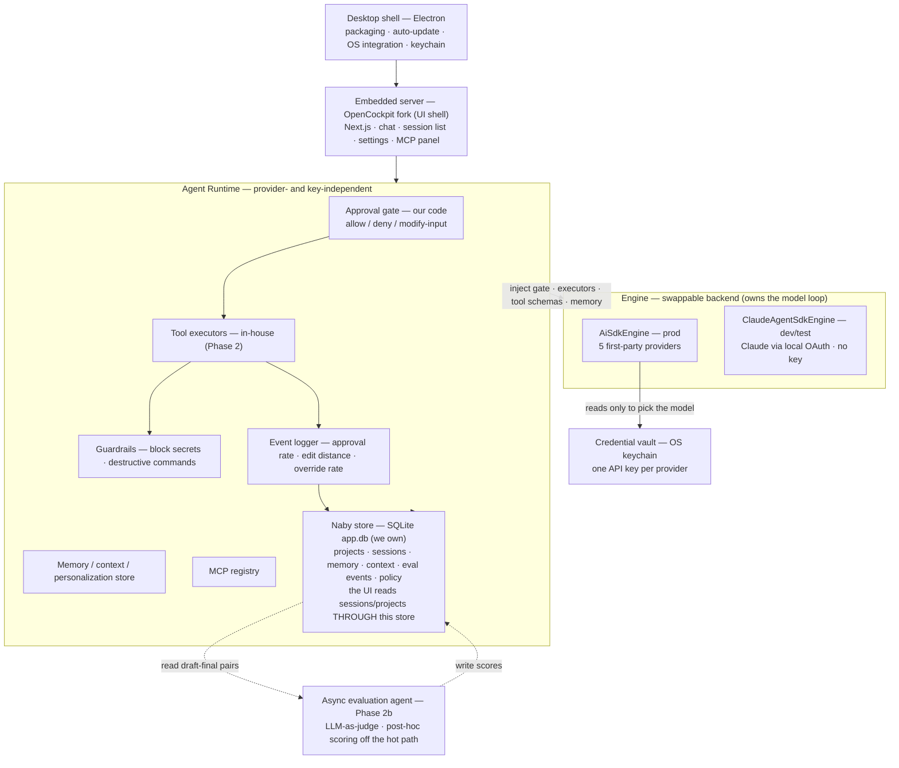

# Personalized Persona Agent Desktop App — Design Overview

> What we are building and why: fork OpenCockpit as the shell, then layer our core capabilities (personalization quality, HITL) on top.

**Document info** · Written 2026-07-19 · Version v0.7 (Draft) · Audience: the team executing this plan, and the project owner · Status: Review

> v0.7 changes — **the Naby Layer is declared the single owner of projects, sessions, memory, and context.** Naby keeps its own canonical records in its runtime store (`app.db`) and serves every session/project/recent/pinned browsing UI *from that store* (§3.6). Provider-native stores (`~/.claude/projects`, …) stay strictly **below** the Naby Layer, read **only by the engine**, never by Naby's session/project UI. **Project** becomes a first-class Naby-owned entity (the store gains a `projects` table; sessions link to a project + provider). This resolves the open `[needs confirmation]` on how much of OpenCockpit's feature-agent survives (§2.3): the browsing UIs survive, but their **data source moves to the Naby store**. Existing `~/.cockpit/projects.json` is imported once into the Naby store on first run (no data loss). Full A→E realignment is in scope → [`phase-1-desktop-shell`](../impl/phase-1-desktop-shell.md).
> v0.6 changes — **the engine becomes a swappable backend, and the runtime layer becomes provider-independent.** Three refinements: (1) an **API key is per provider, with no personal/organization role** — the app just takes a provider's key. (2) **Memory, context, MCP, tools, the gate, and sessions are provider- and key-independent** — switching provider changes only which model answers; everything else carries over (§3.2, §3.3). (3) The **engine is an abstraction with two backends** behind one seam ("engine owns the loop; gate + executors + tools are injected"): **`AiSdkEngine`** (production, five providers) and **`ClaudeAgentSdkEngine`** (dev/test only, Claude via local OAuth, no API key, no metered cost) — both verified to attach our provider-independent gate and executors identically (§3.4).
> v0.5 changes — **the engine pivot.** Five providers became mandatory (Anthropic, Bedrock Claude, Azure OpenAI, Gemini, OpenAI). Investigation showed that serving GPT/Gemini/Azure-OpenAI to the Claude Code engine over a translating gateway is unreliable and unsupported (§3.5), so the **execution engine changes from the Claude Agent SDK to Vercel AI SDK v7** — the only surveyed TS framework with first-party adapters for all five providers plus an ownable pre-execution approval gate (§3.3, §3.4). The approval gate moves from a Claude Code `PreToolUse` hook to **our own code inside the tool executor we own**. Tool executors are now **built in-house** (Phase 2). The OpenCockpit fork is kept for the UI shell and packaging; its engine layer is replaced. A side effect: AI SDK v7 does not persist sessions, so the local SQLite store (F1-05) becomes genuinely necessary rather than redundant — resolving a v0.4 contradiction.
> v0.4 changes: auth reduced to organization API key only (personal-subscription path withdrawn) and multi-provider support added, tiered by wire-protocol compatibility. Superseded by v0.5, which drops the tiering in favor of first-party multi-provider.
> v0.3 changes: split out of the single build plan (`personalized-agent-desktop-app-build-plan`). Execution detail now lives in two phase documents — [`phase-1-desktop-shell`](../impl/phase-1-desktop-shell.md) and [`phase-2-personalization-hitl`](../impl/phase-2-personalization-hitl.md). This document holds only the shared context both depend on.
> v0.2 changes: desktop framework **locked to Electron**; Phase 2 split into **2a (hooks, deterministic) + 2b (asynchronous evaluation agent)**.

---

## Executive Summary

- The goal is a **personalized agent desktop app for internal distribution that non-developers can actually use** — starting chat-first, then expanding into approval-gated automation that "acts on my behalf."
- We do not build the shell from scratch. We **fork OpenCockpit (Surething-io/cockpit)** because it is **MIT licensed** and gives us an Electron-ready chat UI, session list, settings, and MCP panel. Its engine layer — originally the Claude Agent SDK — is **replaced** by our multi-provider engine (§3.2); we keep the shell, not the engine.
- However, OpenCockpit is a **web client-server architecture** (local server + browser). Turning it into an "installable PC app" means **wrapping it in a desktop shell** — the central task of Phase 1 [1].
- **Phase 1** covers: fork → **Electron** desktop packaging → chat-first trimming → **multi-provider API-key auth** → local SQLite session persistence → a working chat round trip. → [`phase-1-desktop-shell`](../impl/phase-1-desktop-shell.md)
- The **agent itself lives in a provider-independent runtime** — gate, tool executors, memory/context, MCP, sessions — beneath which the **engine is a swappable backend**: `AiSdkEngine` (production, Vercel AI SDK v7, five first-party providers) and `ClaudeAgentSdkEngine` (dev/test only, Claude on local OAuth, no key, no cost). Both attach the same gate and executors (§3.4).
- **Phase 2** is the heart of the product. **2a**: the HITL approval gate and guardrails, implemented as **our own deterministic code over every tool call** (not a third-party hook). **2b (asynchronous evaluation agent)**: an LLM-as-judge that scores voice and personalization after the fact, off the send path [2]. → [`phase-2-personalization-hitl`](../impl/phase-2-personalization-hitl.md)
- Authentication is **one API key per provider**, with no personal/organization role, stored in the OS keychain and read only by the engine to select the model.
- The app is **multi-provider by first-party adapter**, not by gateway translation. The five mandatory providers each have a native adapter; there is no reliance on routing non-Claude models through an Anthropic-compatible endpoint (§3.5 explains why that path was rejected).

---

## 1. Background and Purpose

### 1.1 Why this document, now

- Earlier review split the scope into "the shell app (1)" and "our core capabilities (2)", and decided that (1) should be **taken off the shelf but remain modifiable** — hence a fork [1].
- Candidate evaluation originally chose OpenCockpit because it was **MIT and built on the Claude Agent SDK**. The MIT half still holds and is why it remains the shell base; the Agent-SDK half no longer applies, since the engine is being replaced (§3.2) [1].
- What is needed now is **an executable plan to hand to Claude Code** — split into Phase 1/2, stating what to build, in what order, and against what completion criteria.

### 1.2 In scope / out of scope

- **In scope (this plan)**: forking OpenCockpit, desktop packaging, chat-first UI, API-key authentication with tiered multi-provider routing, session handling, MCP management, and Phase 2's personalization quality and HITL approval gate.
- **Out of scope (later phases)**: memory contamination isolation (we only lay the groundwork), domain isolation, an administrator fleet console, A2A/ACP agent-to-agent communication, autonomous (unattended) execution. These are the north star, but not this round.

---

## 2. Terminology and Premises

### 2.1 Key terms

- **Shell**: the app skeleton that wraps the agent engine and presents it to the user (chat window, settings, session list).
- **Agent Harness**: the execution skeleton that handles tool execution, context management, and permissions on your behalf. Here, the Claude Code engine.
- **Engine (Vercel AI SDK v7)**: the library that drives our agent loop, streams responses, reports usage, connects MCP servers, and calls our tools. It provides first-party adapters for all five providers [2].
- **HITL (Human-in-the-Loop)**: a structure where a person approves, edits, or rejects from inside the loop. "AI drafts, human clicks approve."
- **Tool `execute`**: the function the engine calls to run a tool. We write it, so we control it. Our approval gate is a wrapper around every `execute` that `await`s a human decision before the tool acts [3].
- **Approval gate**: our deterministic wrapper around each tool `execute`. It sees every tool call the engine dispatches, `await`s an IPC round-trip to the UI, and returns allow / deny / modified-input. The model cannot bypass it because it can only *request* a tool call, never run one.
- **Personalization Quality**: a quantification of "how much like me was this." Measured not by academic benchmarks but by **real usage signals** (approval rate, edit distance, override rate).

### 2.2 Locked Decisions

| Item | Decision | Implication |
|---|---|---|
| Distribution form | **Packaged desktop app (installable on PC)** | The OpenCockpit web server must be wrapped in a desktop shell |
| Desktop framework | **Electron** | Bundled Node → hosts the Next.js server + our engine as-is (minimum friction) |
| Execution engine | **Abstraction with two backends** — `AiSdkEngine` (prod, Vercel AI SDK v7) + `ClaudeAgentSdkEngine` (dev/test, local OAuth) | Engine owns the loop; runtime injects gate + executors. Seam verified against both backends (§3.4) |
| Runtime layer | **Provider- and key-independent** | Memory, context, MCP, tools, gate, sessions never see a provider or key; switching provider changes only which model answers (§3.4) |
| **Layer ownership** | **The Naby Layer owns projects, sessions, memory, and context** | Naby holds its own canonical records in `app.db` and serves the UI from them. Provider-native stores stay BELOW, read only by the engine, never by Naby's session/project UI (§3.6) |
| **Project entity** | **First-class, Naby-owned** | The runtime store gains a `projects` table; every session links to a project + provider. No session/project browsing UI reads a provider-native store (§3.6) |
| **Browsing-UI data source** | **Re-backed onto the Naby store** | Session/project/recent/pinned lists and the transcript view all read the Naby store; the client API surface is unchanged, only the server implementation moves (§3.6) |
| Tool executors | **Built in-house** (Phase 2) | The engine orchestrates; we supply and run the tools, which is what makes the gate ours |
| Phase 2 composition | **2a deterministic gate + 2b asynchronous evaluation agent** | Control and measurement in our code; judgment by LLM, off the hot path |
| Auth | **One API key per provider — no personal/org role** | The app just takes a provider's key; a key is read only by the engine to select the model |
| First Phase 2 capability | **Personalization quality + HITL approval gate** | Implemented as **our gate over each tool call**, attached per engine — see §3.4 |
| LLM providers | **Five mandatory, first-party** | Anthropic, Bedrock (Claude), Azure OpenAI, Gemini, OpenAI — each via a native AI SDK adapter, not a gateway (§3.5) |

### 2.3 Assumptions (flagged where verification is needed)

- Desktop framework is **locked to Electron** (see 2.2). Tauri was excluded because it requires Node sidecar plumbing. Native-binding build issues (e.g. any node-pty we use for a shell tool) need checking in Phase 0.
- OS priority is assumed to be **Windows + macOS first, Linux later** (most internal non-developers are on Windows). > [needs confirmation]
- OpenCockpit's license is MIT per the repository's own declaration — the **LICENSE file and dependency tree must be verified before forking** [1]. Note the redistribution concern is now smaller: without the Claude Agent SDK we no longer bundle Anthropic's ~247 MB non-OSS engine binaries. > [needs confirmation]
- The five AI SDK provider adapters plus our own tool executors replace the bulk of what the fork's engine layer did. How much of OpenCockpit's `feature-agent` survives that replacement is now **decided** (v0.7): the **browsing UIs survive** — session list, project list, recent, pinned, and the transcript view — but their **data source moves to the Naby store** (§3.6). The fork's direct reads of provider-native and cockpit files (`~/.claude/projects/*.jsonl`, `~/.cockpit/projects.json`, `~/.cockpit/…`) are removed; the same client API surface is re-backed over `app.db`. What does *not* survive is the engine layer and any UI code that read a provider-native store directly.

---

## 3. Product Overview and Architecture

### 3.1 The concept in one sentence

"**A chat shell over a multi-provider agent loop we control**, with a human-approval gate wrapping every tool the agent runs — so non-developers can safely have it act on their behalf, on whichever model the organization chooses."

- The core insight has shifted since v0.4. We no longer inherit the agent loop from a vendor engine; we run **Vercel AI SDK v7's** loop and supply the tools ourselves. That is more work, but it is the only structure that (a) supports all five mandatory providers first-party and (b) puts the approval gate in *our* code, where it is a product invariant rather than a third party's behavior.

### 3.2 Layer architecture


* The **engine owns the model loop and calls back into the injected gate + executors** — the gate is defined once, in the runtime, and each engine attaches it at its own pre-execution point (AI SDK: our execute-less loop; Agent SDK: PreToolUse hook). Same gate logic, different attachment.
* Switching provider (or switching to the dev engine) changes **only which model answers**. Memory, MCP, tools, gate, and sessions are unaffected — they never see a provider or a key.
* Only `AiSdkEngine` reads the credential vault, and only to select the model.
* **K is the Naby store — the single owner of projects, sessions, memory, and context (§3.6).** The session/project browsing UI reads projects and sessions *through K*, never from a provider-native store. Only the engine reads a provider's native store, and only to run a turn.
* Runtime + `AiSdkEngine` + K are Phase 1; executors, guardrails, logger, and L are Phase 2.
* Source: original work (2026)

### 3.3 Auth model — one API key per provider

The app simply takes **a provider's API key** — one per provider, with **no personal/organization distinction and no role**. There is no claude.ai-subscription path (it existed only while the engine was Claude Code, and Anthropic forbids third-party products offering claude.ai login [8]); with five providers, an API key is the only common denominator.

- **Keys are stored in the OS keychain** via Electron `safeStorage`, never in a settings file or in the renderer. See [`phase-1-shell-architecture`](phase-1-shell-architecture.md) §4.1 for the storage caveats (notably the Linux `basic_text` fallback).
- **A key is read in exactly one place — the engine, to select and authenticate the model.** No other layer sees a key. The provider adapters take a key in their factory options; nothing reads ambient environment credentials off the user's machine.
- **Onboarding (F1-06) is key entry, no terminal.** There is no CLI to install and no login flow — the user pastes or selects a key.
- **The key does not scope anything but the model call.** Memory, context, MCP, tools, and sessions are independent of it (§3.4) — switching a key or a provider never changes what the agent remembers or which tools it has.
- **Billing**: per-user quota, cost caps, and key rotation are not solved in this scope; see §6.

### 3.4 Runtime, engine abstraction, and the approval gate

**Everything that makes the agent *itself* lives in a provider- and key-independent Agent Runtime**: the approval gate, the tool executors, the memory/context/personalization store, the MCP registry, and the session store. None of these see a provider or a key. This directly satisfies the requirement that switching provider must not change stored memory or context — a provider is just which model answers the next turn.

Below the runtime sits the **engine**, an abstraction with a deliberately narrow seam: **the engine owns the model loop, and the runtime injects the gate, the tool executors, and the tool schemas into it.** The gate is defined once, in the runtime; each engine attaches it at its own pre-execution point. Two backends implement the seam, both verified:

| Engine | Use | Providers | Auth | Loop / gate attachment |
|---|---|---|---|---|
| **`AiSdkEngine`** | Production | All five, first-party | API key per provider | Tools are **execute-less** — the SDK surfaces each tool call instead of running it; our loop runs the gate and executor. A documented, idiomatic AI SDK v7 pattern; streaming, usage, and continuation all verified intact. |
| **`ClaudeAgentSdkEngine`** | Dev / test only | Claude only | **Local OAuth, no API key, no metered cost** | Built-ins stripped (`tools: []`); our tools exposed as an in-process `createSdkMcpServer` (our handler = our executor); gate attached via a **`PreToolUse` hook** (never `allowedTools`, which silently shadows the gate). |

**Why the gate is sound in both.** The model can only *request* a tool call; it cannot run one. In `AiSdkEngine` our loop holds every call until the gate returns; in `ClaudeAgentSdkEngine` the `PreToolUse` hook fires before our handler and its deny is authoritative even under `bypassPermissions`. Same gate logic, two attachment points. Two things can bypass a handler-level gate, both avoidable by construction:

- **Provider-side server-executed tools** (a provider's hosted web-search that runs on their servers). These never reach our executor. **We enable none of them.**
- **Auto-executing MCP tools.** AI SDK's MCP client binds an `execute` to each tool by default, which would run inside the SDK loop and skip our gate. We instead load MCP tools via `listTools()` (schema only), surface them execute-less through our loop, and dispatch approved calls with `callTool()` ourselves. Tool definitions are pinned and drift-checked to prevent MCP rug-pulls.

**Dev/prod parity.** The dev engine exists so development and testing can run on a local Claude subscription at no metered cost while exercising the *same* runtime — same gate, same executors, same memory, same MCP. Local OAuth used only internally does not implicate the third-party-ToS restriction (which concerns shipping claude.ai login to end users); the local credentials and CLI-login path are never bundled into a release. The one structural difference is loop ownership (the Agent SDK drives its own loop), so the engine boundary normalizes seven divergence points — tool-name shape (`mcp__` prefix), system-prompt injection, tool-call ID shape, turn accounting, streaming schema, thinking blocks, and input rewriting — into one internal event/message format, so "works in dev, breaks in prod" cannot hide in the seam. The gate regression suite (see [`phase-1-test-plan`](../test/phase-1-test-plan.md)) runs against **both** engines.

**Version pinning**: AI SDK ships a major roughly every six months but backports patches to prior majors the same day, giving a real migration runway. Pin the minor and keep both engines behind the runtime's engine interface so a future major — of either SDK — is a contained change.

### 3.5 Why not a translating gateway (the rejected path)

The five providers are served by **native first-party adapters**, not by routing non-Claude models through an Anthropic-compatible gateway. That gateway path — which the v0.4 "Tier 2" rested on — was investigated against the now-mandatory requirement and **rejected**:

- Anthropic published a gateway-protocol reference that **explicitly does not support routing to non-Claude models**, and states the request field/header set is an open list that "varies by release" — i.e. deliberately unstable [9].
- The `thinking: {type: 'adaptive'}` field is sent for unrecognized model aliases with **no client-side off switch** for non-Claude models, and the engine's error-recovery path (which a gateway breaks by rewrapping errors) is the only fallback.
- The bug record is concrete: Gemini multi-turn tool-calling degrades after a few turns (LiteLLM #25322, open); non-Anthropic tool arguments have silently emptied on a gateway patch release (#25321); a gateway emitting the wrong `stop_reason` leaves the agent — and our approval gate — hanging forever with no error (Bifrost #3638).
- **OpenRouter, the largest multi-provider Anthropic-skin operator, publicly declined this use case.**

For a product whose core feature is a reliable approval gate, a path where `tool_use` can arrive empty (approval card for a blank command) or never arrive (gate never fires) is disqualifying. Native adapters put us on each provider's stable first-party API instead of a moving three-way version matrix.

### 3.6 The Naby Layer owns projects, sessions, memory, and context

**The Naby Layer is the single owner of projects, sessions, memory, and context, and it serves them to the UI from its own runtime store (`app.db`).** Provider backends (Claude / Gemini / OpenAI / …) keep their own native session lists, agent lists, context, and memory *below* the Naby Layer — but those native stores are read **only by the engine**, to run a turn on that provider. Naby's session/project browsing UI never reads a provider-native store; it reads Naby's canonical records.

```
┌──────────────────────────────────────────────────────────────────────┐
│                            NABY LAYER  (we own)                        │
│   canonical records in app.db — served straight to the UI             │
│   ┌────────────┬────────────┬────────────┬────────────┬────────────┐  │
│   │  Projects  │  Sessions  │   Agents   │  Context   │   Memory   │  │
│   └────────────┴────────────┴────────────┴────────────┴────────────┘  │
│   session list · project list · recent · pinned · transcript view     │
│   ── all fed from app.db, never from a provider-native store ──        │
└───────────────────────────────▲──────────────────────────────────────┘
                                 │  engine reads native stores ONLY to run a turn
        ┌────────────────────────┼────────────────────────┐
        ▼                        ▼                        ▼
┌────────────────┐      ┌────────────────┐      ┌────────────────┐
│     Claude     │      │     Gemini     │      │  GPT / OpenAI  │   …
│ native sessions│      │ native sessions│      │ native sessions│
│ · agents       │      │ · agents       │      │ · agents       │
│ · context      │      │ · context      │      │ · context      │
│ · memory       │      │ · memory       │      │ · memory       │
│ (~/.claude/…)  │      │  (provider dir)│      │  (provider dir)│
└────────────────┘      └────────────────┘      └────────────────┘
   provider-native stores — BELOW the Naby Layer, read only by the engine
```

- **Naby keeps its own canonical records.** It does not read a provider's native store to render its UI. A provider dir (`~/.claude/projects`, …) is the engine's private input for running a turn on that provider; it is never the source of truth for what projects/sessions the user sees.
- **Project is a first-class Naby entity.** The runtime store gains a `projects` table; every session links to a project (its owning `cwd`) and to a provider (a hint — the last one that answered, §3.4). There was no Project entity and no session↔project link before v0.7 — this closes that gap.
- **Every browsing UI is re-backed onto the Naby store.** Session list, project list, recent, pinned, and the session **transcript** are served from `app.db` (`messages` for the transcript, not a provider `.jsonl`). The **client** API surface (fetchProjects, loadSessionsByProject, …) is unchanged; only the server implementation moves to the Naby store. See [`phase-1-shell-architecture`](phase-1-shell-architecture.md) §8 and [`phase-1-contracts`](../interface/phase-1-contracts.md) §6–§8.
- **One-time import.** Any existing `~/.cockpit/projects.json` is imported once into the Naby `projects` table on first open (idempotent — no data loss). After that, `app.db` is authoritative.

Why this matters: the audit found Naby's store is *written* during every turn (transcripts, memory, usage) but was **invisible to the UI** — no API exposed `listSessions`/`getSession`/`deleteSession`, and every session/project/recent/pinned screen read the *wrong* layer (provider-native `.jsonl` or `~/.cockpit/*` files). v0.7 makes the layer we own the layer the user sees.

---

## 4. Cross-phase Risks and Mitigations

Risks owned by a single phase are tracked in that phase's document. Listed here are those that span both, plus pointers.

- **License contamination** — MIT on the surface can still hide GPL/AGPL in downstream dependencies. → Dependency scanning is mandatory; **never merge anything from the Opcode (AGPL) lineage** [6]. *(First checked in Phase 0; applies to every later dependency addition.)*
- **Dependency licensing across five provider SDKs** — the AI SDK adapters pull each provider's SDK. These are conventionally permissive (Apache-2.0 / MIT), but the transitive tree must still be scanned. The v0.4 concern about redistributing Anthropic's non-OSS ~247 MB engine binaries is **gone** — we no longer bundle the Claude Agent SDK.
- **Owning the tool layer** — the engine no longer supplies sandboxed executors, so we build and secure them. This is the largest new cost of the pivot and the place where a security bug would be most damaging. → Treated as core Phase 2 work with its own threat model; a reduced, safe-by-construction tool set is preferred over a broad, hard-to-sandbox one.
- **Upstream divergence** — replacing the fork's engine layer while tracking upstream UI changes is its own merge burden. → Isolate our engine/tool/gate code behind a module boundary; treat the fork as a UI-shell dependency, not an engine we co-develop. The base repo is single-maintainer with near-daily commits, so keep the surface we touch small.
- **AI SDK major-version cadence** — a new major roughly every six months. → Wrap the SDK behind our own engine interface; run the gate regression suite on every bump. Patches are backported to prior majors, so upgrades have a runway rather than a cliff.
- **Provider adapter drift** — five first-party adapters each track their provider's API independently. → Pin the AI SDK minor; a per-provider smoke test (one tool-using turn per provider) runs in CI so an adapter regression surfaces before release.
- **Shared-key billing exposure** — when several users share one provider key, usage is pooled. → Per-user quota, cost caps, and key rotation are unsolved in this scope; see §6.
- Phase-specific risks: packaging, signing, and update-path risks → [`phase-1-desktop-shell`](../impl/phase-1-desktop-shell.md); prompt injection and 2b evaluation cost → [`phase-2-personalization-hitl`](../impl/phase-2-personalization-hitl.md).

---

## 5. Roadmap / Milestones

| Stage | Content | Deliverable | Size (estimate) | Spec |
|---|---|---|---|---|
| Phase 0 | Fork feasibility spike (SPIKE-01…08) | go/no-go decision | S (~1 week, est.) | `phase-1-desktop-shell` · `phase-1-test-plan` |
| Phase 1 | Electron desktop shell + chat + **AI SDK v7 engine + multi-provider API-key auth** | 3-OS installable app, chat round trip on ≥2 providers | L (est.) | `phase-1-desktop-shell` · `phase-1-shell-architecture` · `phase-1-contracts` · `phase-1-test-plan` |
| Phase 2a | In-house tool executors + HITL approval gate + guardrails + deterministic metrics | Tool layer, approval gate, 3 metrics | L (est.) | `phase-2-personalization-hitl` |
| Phase 2b | Asynchronous evaluation agent (LLM-judge) + score integration | Personalization score, side-by-side dashboard | M (est.) | `phase-2-personalization-hitl` |
| (Later) Phase 3 | Memory contamination isolation, domain isolation, admin console, persona generation agent | Separate plan | — | — |

* Sizes are T-shirt estimates (S/M/L) and must be re-estimated once work begins.

**Document map.** This document holds shared context only. Phase 1 is specified across four documents following the SDD hierarchy: [`phase-1-desktop-shell`](../impl/phase-1-desktop-shell.md) (what to build, in what order), [`phase-1-shell-architecture`](phase-1-shell-architecture.md) (how it is built), [`phase-1-contracts`](../interface/phase-1-contracts.md) (IPC, provider, engine, storage contracts), and [`phase-1-test-plan`](../test/phase-1-test-plan.md) (how it is verified). Phase 2 remains a single document until it reaches implementation.

---

## 6. Open Questions

Product- and architecture-level questions. Phase-local questions live in the phase documents.

- OS priority (Windows first?) and the timing of code signing and notarization.
- Which phase handles **cost caps, quotas, and per-user allocation** for shared API keys (admin console = Phase 3?).
- Where memory and session data are stored, and the **encryption policy** (whether local SQLite is encrypted).
- **The in-house tool set** — which tools ship (shell? file edit? web fetch?) and what the sandboxing model is per OS. This is the biggest scoping question the pivot introduces; a smaller safe-by-construction set may beat a broad one.
- **Which provider the 2b judge runs on** — a strength of the multi-provider engine is scoring Claude output with a non-Claude model, avoiding the same-model blind spot.
- Settling the edit distance formula (token diff vs. normalized Levenshtein). *(Blocks Phase 2a F2-04.)*
- **Whether the dev engine (`ClaudeAgentSdkEngine`) ships in Phase 1 or is a Phase-0 harness only** — it is verified feasible, but every hour spent on the dev backend is not spent on the production one. Decide how much dev/prod parity is worth up front.
- Whether interactive usage and Phase 2b scoring need separate cost caps.

---

## References

Canonical list. The phase documents cite the same numbers.

1. Surething-io (2026), cockpit — The open-source Claude Code GUI, Local-first, MIT, https://github.com/Surething-io/cockpit
2. Vercel (2026), AI SDK — Providers and Models (first-party adapters: openai, azure, anthropic, amazon-bedrock, google), https://ai-sdk.dev/docs/foundations/providers-and-models
3. Vercel (2026), AI SDK — Tool calling, `needsApproval`, and tool-approval content parts, https://ai-sdk.dev/docs/ai-sdk-core/tools-and-tool-calling
6. getAsterisk (2026), opcode — AGPL License, https://github.com/getAsterisk/opcode
7. Nitin (2026-05-05), Building a Customer Support Triage Agent with Claude — HITL acceptance, https://medium.com/@nitin_26346/building-a-customer-support-triage-agent-with-claude-a-walkthrough-89a812cc09bf
8. Anthropic (2026), Claude Agent SDK overview — the third-party claude.ai login restriction (basis for not offering a subscription path), https://code.claude.com/docs/en/agent-sdk/overview
9. Anthropic (2026), LLM gateway configuration — "Anthropic … doesn't support routing Claude Code to non-Claude models through any gateway", https://code.claude.com/docs/en/llm-gateway
10. Anthropic (2026), LLM gateway protocol — the open-list field/header contract that makes the gateway path unstable, https://code.claude.com/docs/en/llm-gateway-protocol

*References [2] and [3] were repointed in v0.5 from Claude Agent SDK guides to the Vercel AI SDK docs, reflecting the engine change. [8]–[10] now document why the Claude-only and gateway paths were rejected rather than adopted.*
