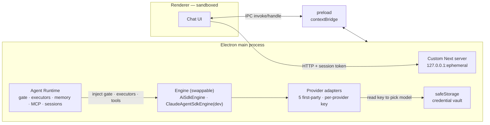

# Phase 1 — Desktop Shell Technical Design

> How the Phase 1 features in [`phase-1-desktop-shell`](../impl/phase-1-desktop-shell.md) are built. Product-level decisions live in [`personalized-agent-desktop-app`](personalized-agent-desktop-app.md).

**Evidence marking.** Claims are tagged `[V]` verified against official documentation or source, `[E]` verified empirically in this project's investigation, `[C]` community-sourced (issue tracker or blog), `[?]` unverified inference. Anything `[?]` or `[C]` that is load-bearing has a corresponding spike in [`phase-1-test-plan`](../test/phase-1-test-plan.md).

**Version baseline**: Electron 43.1.1 · Next.js 16.2.x · **`ai` (Vercel AI SDK) v7 + `@ai-sdk/{openai,azure,anthropic,amazon-bedrock,google}`, minor pinned** · node-pty 1.1.0 (only if a shell tool ships — see §3.2) · `@anthropic-ai/claude-agent-sdk` 0.3.215 (**dev/test engine only, never in a shipped build**) · electron-builder 26.15.x.

---

## 1. Process model



**Everything privileged lives in main.** The renderer keeps Electron 43 defaults — `contextIsolation: true`, `sandbox: true`, `nodeIntegration: false`, `webSecurity: true` `[V]`. A sandboxed preload still gets `contextBridge` and `ipcRenderer` `[V]`, which is all the bridge needs, so the sandbox stays on.

**The runtime is provider-independent; only the engine and its provider adapter touch a key.** The gate, executors, memory, MCP registry, and session store never see a provider or a key — the engine is the sole boundary at which a provider is selected (design §3.4).

Bridge constraints `[V]`: structured clone governs every payload — symbols and prototypes are dropped, and an error thrown in an `ipcMain.handle` handler reaches the renderer with only its `.message`. Error taxonomy therefore has to travel as data, not as exception types (see [`phase-1-contracts`](../interface/phase-1-contracts.md)). Never expose `ipcRenderer` wholesale, and validate `event.senderFrame` against an allowlist in every handler `[V]`.

**node-pty, if used, runs in the main process** `[V]` — the sanctioned pattern. It is only needed if a shell/PTY tool ships in the Phase 2 tool set; a chat-only Phase 1 does not require it. It cannot run in a renderer on Windows, where its conout connection uses `worker_threads` `[C]`. Whether `utilityProcess` would isolate a known teardown SIGABRT `[C]` is untested in public `[?]` and is deferred, not designed around.

---

## 2. Embedded Next server

### 2.1 Custom server, not standalone

`output: 'standalone'` and a custom server are **mutually exclusive** `[V]`, and standalone's generated `server.js` calls `process.chdir(__dirname)`, which asar cannot satisfy — you can never set the working directory inside an archive `[V]`. Standalone inside asar is therefore impossible by construction, and only the custom server exposes the `httpServer` option we need for port readback.

Neither Next nor Electron documents this integration `[V]` — every pattern below is community-derived and carries a spike.

### 2.2 Binding and readiness

```js
server.listen(0, '127.0.0.1');          // ephemeral port, no TOCTOU race
await once(server, 'listening');
const { port } = server.address();
const app = next({ dev: false, dir: absoluteDir, httpServer: server });
```

Bind the **literal `127.0.0.1`**, never `0.0.0.0` — note Next's own `next start` defaults to `0.0.0.0` `[V]`. `127.0.0.0/8` is unconditionally a secure context `[V]`, and the literal address avoids any resolver dependency.

Take the port from the bound handle rather than probing: Next has **no production port-collision fallback** — its EADDRINUSE retry is gated on dev mode, and production logs and exits `[V]`. Keep `did-fail-load` (guarded on `isMainFrame`) as a backoff net, not as the primary readiness signal.

`next({dir})` defaults to `process.cwd()`, which in a packaged macOS app is typically `/` `[V]`. **Always pass an absolute `dir`** derived from `app.getAppPath()`.

### 2.3 Writable cache

A production Next server writes ISR, fetch, and image caches to disk at runtime `[V]`, and the install location is read-only. Route them to `app.getPath('userData')` via `cacheHandler` with `cacheMaxMemorySize: 0`. Next 16 splits this: `cacheHandler` does not cover `'use cache'` (that needs `cacheHandlers`, plural) and image caching needs `images.customCacheHandler: true` `[V]`.

`NEXT_PRIVATE_CACHE_DIR` circulates in community answers but could not be confirmed in Next's source `[?]` — **do not rely on it.**

---

## 3. Native and vendored payloads

The engine pivot **removes the largest payload problem.** The production engine is the Vercel AI SDK plus five provider SDKs — **pure JavaScript**, bundled normally, with no native binary to unpack and no ~247 MB per-platform engine. The only native payload in production is **node-pty**, and only if a shell/PTY tool ships (§3.2). The Claude Agent SDK's native engine binary is a **dev-only** dependency and is never in a shipped build, so its asar/notarization concerns do not apply to releases.

### 3.1 The asar rule

Anything that gets `dlopen`ed or `spawn`ed must live outside the archive `[V]`. In production that is at most node-pty.

**Do not compute unpacked paths with a naive `.replace('app.asar', 'app.asar.unpacked')`.** Because `'app.asar.unpacked'` itself contains `'app.asar'`, an already-unpacked path becomes `app.asar.unpacked.unpacked/…` → ENOENT, surfacing as a generic spawn failure. This is a live upstream bug in node-pty itself `[C]`, and the same footgun applies to our own path computation. Anchor the replacement to the end of the archive segment.

### 3.2 node-pty

It is pure Node-API `[E]` — symbol inspection shows `napi_register_module_v1` and zero `v8::` symbols — so its prebuilds are ABI-stable across Electron versions and no per-Electron rebuild is needed. Electron's own docs never state this `[?]`, so it is spike-backed rather than doc-backed.

**Set `npmRebuild: false`.** electron-builder defaults it to `true`, and `@electron/rebuild` cannot see node-pty's prebuilds anyway — it gates prebuild lookup on a `prebuildify` devDependency node-pty does not have, and matches filenames node-pty does not use `[V]`. The default therefore recompiles on every packaging run, forfeiting the prebuilds and forcing a full native toolchain onto every runner.

**Version decision required**: `1.1.0` ships **no Linux prebuild** (source build) while `1.2.0-beta` ships all three `[V]`. Shipping Linux on `npmRebuild: false` means moving to the beta line. This is an open decision, not a settled one.

Set `asarUnpack: ["**/node_modules/node-pty/**"]` explicitly rather than trusting `smartUnpack` — auto-detection is gated on the file resolving as part of an npm module `[V]`. On Windows, `conpty.dll` must sit in a real-filesystem `conpty/` directory next to `conpty.node`, because the loader does `GetModuleFileNameW` → `PathCombineW` → `LoadLibraryW`, and `LoadLibraryW` cannot read an asar `[V]`. On Unix, `spawn-helper` must keep mode 0755 and, under macOS hardened runtime, must be signed.

### 3.3 Engine packaging

**Production (`AiSdkEngine`)** is `ai` + `@ai-sdk/*` — pure JS. It bundles normally; there is nothing to `asarUnpack` and no `pathToClaudeCodeExecutable`-style resolution problem. Add `serverExternalPackages` only for any adapter that itself pulls a native transitive dependency (none of the five is known to, but scan in SPIKE-01).

**Dev engine (`ClaudeAgentSdkEngine`)** carries the Agent SDK's native binary and would need the asar-unpack + explicit-executable-path handling described for native payloads — **but it is never packaged into a release.** In dev it runs from `node_modules` on the developer's machine (local OAuth, no bundling). If a dev build is ever packaged for internal testing, treat the Agent SDK exactly like node-pty (§3.1–3.2) and exclude it from any production `files` glob.

**Size**: the installer is far smaller than the Agent-SDK plan — no 247 MB engine binary. Electron (~150 MB) + Next + five JS provider SDKs is the bulk; delta updates still matter but the floor is much lower.

---

## 4. Credentials and provider routing

### 4.1 Storage

**`safeStorage`, main process only** `[V]`. keytar is archived and not an option `[V]`. Prefer the async API — the docs state the synchronous one may be deprecated `[V]` — but which Electron major shipped it could not be pinned `[?]`; verify against the target before writing `await` into the implementation.

The **Linux fallback is the design constraint**: where no secret store is available, `safeStorage` silently encrypts with a hardcoded plaintext password `[V]`. Tiling window managers hit this in shipped software `[C]`. Therefore, after `app.whenReady()`: check `isEncryptionAvailable()`, and on Linux check `getSelectedStorageBackend() !== 'basic_text'`. If it is `basic_text`, **surface a real warning** rather than silently storing an API key in effective plaintext. `getSelectedStorageBackend()` returns `unknown` before ready `[V]`, so the ordering matters.

`safeStorage` protects against disk theft and other user accounts. It does not protect against local malware `[C]` — with a shared key in play, that limit should be stated to whoever owns the key.

### 4.2 Credential injection

One API key per provider, no role (design §3.3). Keys are passed to the AI SDK provider factory **explicitly in code** — e.g. `createOpenAI({ apiKey })`, `createAnthropic({ apiKey })` — never via ambient environment variables read off the user's machine. The key is read at exactly one point: when the engine constructs the provider for a turn. No other layer touches it.

For the **dev engine** only, the Claude Agent SDK resolves credentials from the developer's local OAuth session (no key, `apiKeySource: 'none'`); this path exists solely in dev and is never bundled.

### 4.3 MCP registry is owned and provider-independent

We own the MCP server list; it lives in the runtime, keyed to the user/workspace, **not** to a provider or key. Switching provider does not change the MCP surface.

MCP tools are loaded through the gate, not around it. AI SDK v7's MCP client binds an auto-executing `execute` to each tool via `client.tools()`, which would run inside the SDK loop and skip our gate. We instead call **`client.listTools()`** for the schemas, wrap each as an **execute-less** tool surfaced to our loop, and dispatch approved calls with **`client.callTool()`** ourselves `[E]`. Definitions are pinned and drift-checked (`fingerprintTools()` / `detectToolDrift()`) to prevent an MCP server from silently changing a tool between connects. The contract is in [`phase-1-contracts`](../interface/phase-1-contracts.md) §4.

### 4.4 Provider adapters

Five first-party AI SDK adapters — `@ai-sdk/openai`, `@ai-sdk/azure`, `@ai-sdk/anthropic`, `@ai-sdk/amazon-bedrock`, `@ai-sdk/google`. Each is constructed from its provider key (plus provider-specific config: Azure resource/deployment, Bedrock region, Vertex/Google project). The tool-call surfacing is provider-agnostic — it lives in the `ai` core, and every adapter presents a conforming `LanguageModelV4`, so the execute-less gate behaves identically across all five `[V]`.

Per-provider quirks to normalize at the engine boundary (so the runtime never sees them): Azure OpenAI uses **deployment names** rather than model IDs and an `api-version`; Bedrock uses inference-profile IDs; Gemini's tool-call ID shape differs. Route by the configured provider/credential, never by parsing a model name out of a response.

---

## 5. Localhost hardening

A local HTTP server in a desktop app is a proven CVE class. **CVE-2025-52882** (CVSS 8.8) was exactly this shape in Anthropic's own VS Code extension: a localhost WebSocket with no auth and no Origin validation, letting any web page read files and execute code `[V]`. Vite's CVE-2025-24010 was a missing Host check `[V]`.

**Port randomization is not a mitigation** — the Claude Code attack defeated it by scanning from the attacker's page `[V]`.

Four controls, all required:

1. **Validate `Host`** against the exact `127.0.0.1:PORT`, else 403. This is the DNS-rebinding kill switch: a rebound request still carries the attacker's hostname `[C]`.
2. **Validate `Origin`**, especially on WebSocket upgrades — handshakes send `Origin` and are not CORS-preflighted.
3. **Bind `127.0.0.1`**, never `0.0.0.0` (§2.2).
4. **Per-launch random session token**, injected through preload/contextBridge and required on every request. This is the only control that covers *other local processes* — loopback is not an authentication boundary.

Renderer-side security warnings will not help here: Electron exempts localhost from its warning list `[V]`, so the configuration looks clean while the vulnerability sits in the server.

**Asar integrity** (`EnableEmbeddedAsarIntegrityValidation` + `OnlyLoadAppFromAsar`) is available `[V]`, but unpacked files sit outside the archive and are therefore outside validation `[?]`. In production this leaves only node-pty's tree (if shipped) uncovered — a much smaller surface than the old plan's engine binary. Enable it, but do not present it as covering the native payload.

---

## 6. Packaging and update pipeline

### 6.1 Build matrix

A per-OS CI matrix is required for one firm reason and possibly a second: `.dmg` has a hard macOS-host guard in electron-builder's source `[V]`, so macOS must build on macOS regardless. The old second reason — the Agent SDK's eight `os`/`cpu`-gated platform packages — **is gone**, since the production engine is pure JS. If a shell tool ships, node-pty's native prebuilds reintroduce a per-OS concern, but that is a much smaller, single-module surface.

Three separate jobs on `macos-latest` / `windows-latest` / `ubuntu-latest`, tag-triggered `[V]`. Note `macos-latest` is arm64 `[V]`; whether universal/x64 cross-builds are reliable there is unverified and known-fragile `[C]` — now compounded only by node-pty's ship-everything prebuild layout (if used), not the engine's.

**Targets**: NSIS `.exe` (Windows), `.dmg` (macOS), `.AppImage` **and `.deb`** (Linux).

- **MSI is not an option for the update path** — electron-updater does not support it `[V]`. It can ship as an additional enterprise artifact with its own SCCM/Intune story, but NSIS is the only updatable Windows target.
- **`.deb` alongside `.AppImage` is close to mandatory**: Chromium's SUID sandbox needs `chrome-sandbox` root-owned 4755, which a user-owned FUSE mount cannot provide, and Ubuntu 23.10+ blocks the namespace fallback — so Electron AppImages fail to launch without `--no-sandbox` `[C]`. electron-builder supports AppArmor profiles for deb/rpm.

### 6.2 Auto-update by platform

| Platform | Unsigned auto-update | Basis |
|---|---|---|
| **Windows** | **Works** | electron-updater skips verification entirely when `publisherName` is null, which is the unsigned case `[V]`. No announced expiry |
| **Linux** | **Works** | AppImage/deb/rpm are auto-updatable; blockmap gives delta updates `[V]` |
| **macOS** | **Blocked** | Squirrel.Mac captures the running app's designated requirement via `SecCodeCopySelf()` and validates the download against it. Unsigned, step one fails `[V]`. There is no electron-updater-level switch — the control is in Apple's Security framework |

So F1-09 ships on Windows and Linux immediately and no-ops (or routes to a download page) on unsigned macOS.

**The one-way door.** Because validation is against the *running* app's designated requirement, **rotating the macOS signing certificate strands every already-installed user** — they cannot auto-update and need a manual re-download. Windows has an escape (`publisherName` accepts an array of old and new names); macOS has none. Choose the Developer ID identity before the first macOS release and treat it as permanent.

Operational notes: the `zip` target must be enabled even when only shipping `.dmg`, since Squirrel updates via zip `[V]`. `altool` is retired — `notarytool` only `[V]`. A ZIP cannot be stapled; staple the `.app`, then zip `[V]`.

### 6.3 Signing, when it is scheduled

- **macOS**: Developer ID Application, $99/yr. `hardenedRuntime` defaults true, `gatekeeperAssess` defaults false; Electron needs `com.apple.security.cs.allow-jit` and `allow-unsigned-executable-memory` `[V]`.
- **Windows**: OV keys must live on FIPS 140-2 L2 hardware or a cloud HSM since June 2023 — **a `.pfx` in CI secrets is no longer possible** `[V]`. Max validity is 460 days from 2026-03-01 `[V]`. Azure Artifact Signing (~$10/month `[V]`) is the default-correct answer via `win.azureSignOptions`; its certificates are renewed daily with 72-hour validity, making **RFC 3161 timestamping mandatory rather than best practice** `[V]`.
- **EV certificates no longer bypass SmartScreen** `[V]`, despite most reseller pages still claiming otherwise. Do not buy EV for that reason.

**Update feed**: a private GitHub repo requires a `GH_TOKEN` embedded in the installer, readable by anyone who unpacks it `[V]`, and each check costs up to 3 of 5,000 requests/hour. If the source must stay private, use the generic provider against a public bucket.

---

## 7. Deferred, with reasons

- **utilityProcess for node-pty** — would isolate a known teardown crash, but no public evidence either way `[?]`. Revisit if the crash appears.
- **Universal macOS binaries** — only a concern if a native module (node-pty) ships; without the old engine binary the asar-merge conflict is much smaller. Ship per-arch until there is a reason not to.
- **Asar integrity as a security control** — enable the fuses, but the native payloads are uncovered (§5), so it is defense in depth, not a boundary.

---

## References

Numbering matches the canonical list in [`personalized-agent-desktop-app`](personalized-agent-desktop-app.md); design-specific sources are cited inline above.
