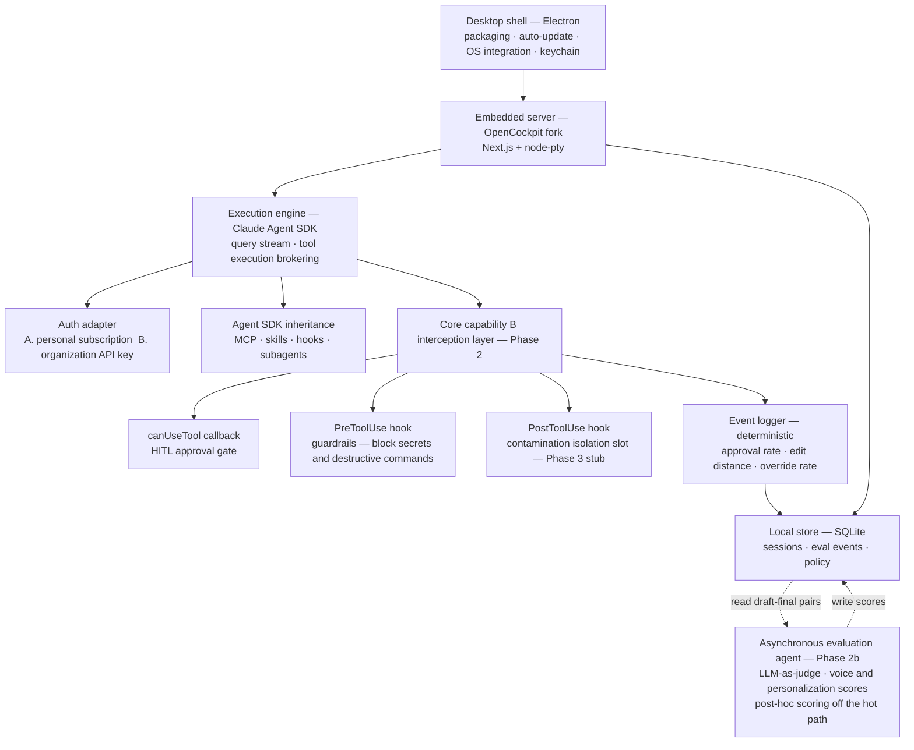
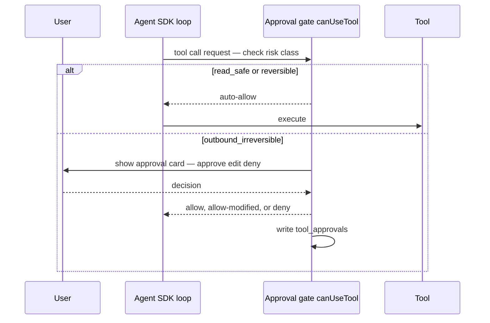

# Personalized Persona Agent Desktop App — Build Plan

> Phase 1/2 execution plan: fork OpenCockpit as the shell, then layer our core capabilities (personalization quality, HITL) on top.

**Document info** · Written 2026-07-19 · Version v0.2 (Draft) · Audience: the Claude Code instance executing this plan, and the project owner · Status: Review
> v0.2 changes: desktop framework **locked to Electron**; Phase 2 split into **2a (hooks, deterministic) + 2b (asynchronous evaluation agent)**.

---

## Executive Summary

- The goal is a **personalized agent desktop app for internal distribution that non-developers can actually use** — starting chat-first, then expanding into approval-gated automation that "acts on my behalf."
- We do not build the shell from scratch. We **fork OpenCockpit (Surething-io/cockpit)**, for two reasons: it is **MIT licensed**, so commercial modification is unrestricted, and it stands on the **official Claude Agent SDK**, so we can plug our core capabilities directly into the agent loop [1].
- However, OpenCockpit is a **web client-server architecture** (local server + browser). Turning it into an "installable PC app" means **wrapping it in a desktop shell** — the central task of Phase 1 [1].
- **Phase 1** covers: fork → **Electron** desktop packaging → chat-first trimming → hybrid authentication → a working chat round trip.
- **Phase 2** is the heart of the product. **2a (deterministic hooks)**: implement the HITL approval gate, guardrails, and quantitative metrics on top of Agent SDK hooks. **2b (asynchronous evaluation agent)**: an LLM-as-judge that scores voice and personalization after the fact, off the send path [2][3].
- Authentication and billing are **hybrid** — personal subscriptions for development and individual use, an organization API key for shared and automated use. An auth adapter makes the two paths switchable [4][5].

---

## 1. Background and Purpose

### 1.1 Why this document, now

- Earlier review split the scope into "the shell app (1)" and "our core capabilities (2)", and decided that (1) should be **taken off the shelf but remain modifiable** — hence a fork [1].
- Candidate evaluation found **OpenCockpit to be the only option satisfying "MIT + built on the official Agent SDK" simultaneously** → confirmed as the fork base [1].
- What is needed now is **an executable plan to hand to Claude Code** — split into Phase 1/2, stating what to build, in what order, and against what completion criteria.

### 1.2 In scope / out of scope

- **In scope (this plan)**: forking OpenCockpit, desktop packaging, chat-first UI, hybrid authentication, session persistence, MCP management, and Phase 2's personalization quality and HITL approval gate.
- **Out of scope (later phases)**: memory contamination isolation (we only lay the groundwork), domain isolation, an administrator fleet console, A2A/ACP agent-to-agent communication, autonomous (unattended) execution. These are the north star, but not this round.

---

## 2. Terminology and Premises

### 2.1 Key terms

- **Shell**: the app skeleton that wraps the agent engine and presents it to the user (chat window, settings, session list).
- **Agent Harness**: the execution skeleton that handles tool execution, context management, and permissions on your behalf. Here, the Claude Code engine.
- **Agent SDK (Claude Agent SDK)**: the official library that drives the same agent loop as Claude Code from code. Conversations stream through `query()`, and it brokers tool calls [2].
- **HITL (Human-in-the-Loop)**: a structure where a person approves, edits, or rejects from inside the loop. "AI drafts, human clicks approve."
- **`canUseTool` callback**: the runtime decision point where code allows, denies, or modifies each tool call not already covered by an allow/deny list — the home of our approval gate [3].
- **Hook**: deterministic code injected at fixed points in the agent lifecycle (PreToolUse, PostToolUse, etc.). Because it is code rather than model judgment, it is the most trustworthy guardrail available [3].
- **Personalization Quality**: a quantification of "how much like me was this." Measured not by academic benchmarks but by **real usage signals** (approval rate, edit distance, override rate).

### 2.2 Locked Decisions

| Item | Decision | Implication |
|---|---|---|
| Distribution form | **Packaged desktop app (installable on PC)** | The OpenCockpit web server must be wrapped in a desktop shell |
| Desktop framework | **Electron** | Bundled Node → hosts the Next.js + node-pty + Agent SDK server as-is (minimum friction) |
| Phase 2 composition | **2a deterministic hooks + 2b asynchronous evaluation agent** | Control and measurement in code; judgment by LLM, off the hot path |
| Auth / billing | **Hybrid** (personal subscription + shared API key) | Auth adapter switches between the two paths |
| First Phase 2 capability | **Personalization quality + HITL approval gate** | Implemented on top of Agent SDK hooks |
| Primary LLM | **Claude first** (open models later) | OpenCockpit's default engine = Claude Agent SDK [1] |

### 2.3 Assumptions (flagged where verification is needed)

- Desktop framework is **locked to Electron** (see 2.2). Tauri was excluded because it requires Node sidecar plumbing. Only the 3-OS build issues around node-pty native bindings need checking in Phase 0.
- OS priority is assumed to be **Windows + macOS first, Linux later** (most internal non-developers are on Windows). > [needs confirmation]
- OpenCockpit's license is MIT per the repository's own declaration — the **LICENSE file and dependency tree must be verified before forking** [1]. > [needs confirmation]

---

## 3. Product Overview and Architecture

### 3.1 The concept in one sentence

"**A thin chat shell on top of the official Agent SDK**, with approval and quality-measurement layers plugged into the inside of the loop — so non-developers can safely have it act on their behalf."

- The core insight: the hard part (the agent loop) is already built by Anthropic in the Agent SDK. What we build is only **a thin shell plus the insertion points inside the loop (B)** [2][3].

### 3.2 Layer architecture


* Solid lines = synchronous (hot path); dotted lines = asynchronous (never blocks the send path).
* Source: original work (2026)

### 3.3 Auth adapter (hybrid model)

- **Path A — personal subscription**: drive the `claude` CLI / Agent SDK that the user has already authenticated locally with their own account. OpenCockpit does the same, offering "zero setup if the claude CLI is configured" [1]. Programmatic use currently draws down the subscription quota (the 6/15 separation proposal is on hold) [5].
- **Path B — organization API key**: setting `ANTHROPIC_API_KEY` (an org key) overrides the subscription and bills per usage. Anthropic recommends this path for shared and production automation [4].
- **Caution**: an app **brokering a user's subscription directly via OAuth risks violating the ToS** — Path A must only ever "drive the user's local authentication" [4].

---

## 4. Phase 1 — Chat-first Desktop Shell

Goal: a 3-OS installable app in which **a non-developer can install → log in → complete one chat round trip**. Fork OpenCockpit with minimal modification, wrap it for desktop, and trim it to chat-first.

### 4.1 Phase 0 — Fork feasibility spike (precondition)

- Before committing, the following must be **verified within one week** and pass before entering Phase 1.
- If it does not pass, the fallback is: "a thin self-built shell on the Agent SDK + a tool-manager panel" (see Risks).

- [SPIKE-01] Scan the LICENSE file and dependency tree — confirm MIT and that no GPL/AGPL is mixed in downstream (`license-checker` / `cargo-deny`) [1][6].
- [SPIKE-02] Boot `@surething/cockpit` locally and complete one chat round trip on the Claude engine.
- [SPIKE-03] **Verify hook accessibility in the Agent SDK** — whether code can actually be injected into `canUseTool` and PreToolUse/PostToolUse. This is the make-or-break condition for (B) [3].
- [SPIKE-04] Electron wrapping PoC — boot the Next.js server from the Electron main process and have the webview load localhost.

### 4.2 Phase 1 feature list

| ID | Feature | Description | Priority | Completion criteria (summary) |
|------|------|------|------|------|
| F1-01 | Fork setup | Fork the repository, reproduce the build, track an upstream branch | Must | Local build and boot succeed |
| F1-02 | Desktop packaging | Electron shell embeds the Next.js server + webview | Must | App launches from a single executable |
| F1-03 | Chat-first trimming | Hide/remove IDE surfaces (DB, code review, browser, etc.); a single chat + session list + settings | Must | Non-developer screen exposes chat only |
| F1-04 | Hybrid authentication | Detect personal subscription / enter org API key, **store in OS keychain**, toggle between paths | Must | Chat succeeds on both paths |
| F1-05 | Session persistence | Store and resume sessions in local SQLite | Must | Sessions restore after app restart |
| F1-06 | Onboarding wizard | Guide login/key entry on first run, **no terminal required** | Must | Non-developer completes it unaided |
| F1-07 | Cost / usage display | Personal usage and cost view (leaves a hook for the admin console) | Should | Per-session cost displayed |
| F1-08 | MCP management panel | Add/remove/status/test MCP servers (port the tool-manager UX, or minimal CRUD) | Should | One MCP connected and used |
| F1-09 | Auto-update | Version detection, download, restart (electron-updater) | Should | New version applies automatically |
| F1-10 | 3-OS builds | Win (.msi/.exe) · Mac (.dmg) · Linux (.AppImage) pipeline; code signing and notarization come later | Should | Artifacts produced for all 3 OSes |

Priority uses MoSCoW (**M**ust / **S**hould / **C**ould / **W**on't).

### 4.3 Phase 1 minimal-modification principle

- **Minimize divergence from upstream (OpenCockpit)** — trim via "hide / config flag" rather than deletion; keep deletions to a minimum. This lowers maintenance and upstream-merge cost.
- **Isolate our code in a separate module** — do not mix the (B) layer into the fork body; separate it behind a plugin/module boundary (in preparation for Phase 2).

### 4.4 Phase 1 Definition of Done

- A non-developer completes **install → onboarding wizard → one chat round trip** without touching a terminal.
- **Both paths** — personal subscription and organization API key — work.
- Windows and macOS installers are produced (Linux may lag).

---

## 5. Phase 2 — Personalization Quality Measurement + HITL Approval Gate

Goal: add two planes to the agent loop. **2a (deterministic hooks)** guarantees, in code, a **HITL approval gate** over outbound and destructive actions plus quantitative metrics. **2b (asynchronous evaluation agent)** scores "how much like me did it write" via **LLM-as-judge** after the fact, complementing the 2a metrics [3].

### 5.1 Why this is the heart of the product

- It places a safety catch at the highest-risk point of "acting on my behalf" (autonomous outbound), while simultaneously **verifying numerically** whether personalization is actually happening.
- In practice, "AI drafts → human clicks approve" sees near-universal acceptance, while "AI sends autonomously" is near-universally rejected — HITL is a precondition for landing in production [7].
- Academic memory benchmarks (LoCoMo and similar) measure "factual recall" and therefore cannot measure "like me" → replaced with **real usage signals**.

### 5.1.5 Why hooks (2a) and the agent (2b) are separated

- The principle: **control and measurement are deterministic (hooks); judgment and generation belong to the agent (LLM). Never let an LLM decide an irreversible action.**
- **The HITL approval gate and guardrails must be code (2a)** — they are security controls requiring 100% guarantee, and the PreToolUse hook is deterministic code rather than model judgment, making it the most trustworthy guardrail [3].
- **"Is this my voice?" is a nuanced judgment (2b)** — hooks cannot measure it, so a lightweight evaluation agent handles it.
- **2b runs off the hot path (asynchronously)** — it scores logged draft→final pairs after the fact so it never blocks the send path. The cost and latency of extra LLM calls are managed via batching and caching so they do not degrade real usage.
- An analogy: the hooks are the "approval stamp and CCTV" (always behaving identically); the evaluation agent is the "quality inspector" (sampling and grading after the fact). Put the inspector in the approval chain and approvals become slow and inconsistent.

### 5.2 Phase 2 feature list

**Phase 2a — deterministic hooks (safety and measurement plane, hot path)**

| ID | Feature | Description | Priority | Completion criteria (summary) |
|------|------|------|------|------|
| F2-01 | Tool risk classification | Tag each tool read-safe / reversible / outbound-irreversible + a policy file | Must | Classification loads from the policy file |
| F2-02 | HITL approval gate | On an outbound call, pause via `canUseTool` → approve/edit/deny card → apply the decision (including allow-after-edit) | Must | 100% of outbound calls pass the gate [3] |
| F2-03 | Guardrail hooks | Deterministically block secret access, destructive bash, etc. via PreToolUse | Must | Designated risky actions confirmed blocked [3] |
| F2-04 | Eval event logger | Record draft creation, user edits, and final confirmation | Must | Events land in SQLite |
| F2-05 | Quality dashboard | Approval rate, edit distance, override rate over time + per-session drill-down | Must | All three metrics visualized |
| F2-06 | Contamination isolation stub | Reserve the PostToolUse isolation hook slot (email, web content) | Could | Hook entry point exists [3] |

**Phase 2b — asynchronous evaluation agent (judgment plane, off the hot path)**

| ID | Feature | Description | Priority | Completion criteria (summary) |
|------|------|------|------|------|
| F2-07 | Evaluation agent (LLM-as-judge) | Score logged draft→final pairs **asynchronously and post hoc** (voice and personalization score, 0–1). Never blocks the send path | Should | A personalization score is recorded per draft |
| F2-08 | Isolated subagent execution | Run scoring in an **isolated subagent context** to prevent contaminating the main conversation context | Should | Main session context unchanged |
| F2-09 | Dashboard integration | Show deterministic metrics (2a) and judge scores (2b) **side by side** to surface correlation over time | Could | Both metric series displayed together |

- Execution model: F2-07 runs **on a batch (periodic) schedule or a low-load trigger**, keeping cost and latency off the hot path. Identical draft/prompt pairs are cached to avoid re-scoring.

### 5.3 Personalization quality metric definitions

- **Approval Rate** = drafts approved as-is ÷ total drafts.
- **Edit Distance** = the normalized amount of change from draft to final (token diff or normalized Levenshtein). Lower means it came out more "like me."
- **Override Rate** = the proportion denied or heavily modified at the approval gate.
- **Personalization Score (2b)** = the voice/tone match (0–1) assigned by the evaluation agent after reading a draft→final pair. An LLM judgment metric that **complements** the three deterministic metrics above — never used as sole evidence, always reported alongside them.
- An analogy: you have a new assistant draft something and record **how much you rewrite** every day (deterministic), while a separate inspector grades **whether the voice sounds like you** after the fact (2b). When there is less to fix and the score rises, learning has happened.

### 5.4 Data model (SQLite, draft)

```sql
-- Eval event: one draft→final record
CREATE TABLE eval_events (
  id            TEXT PRIMARY KEY,
  session_id    TEXT NOT NULL,
  domain        TEXT,            -- work / personal etc. (prep for Phase 3 isolation)
  task_type     TEXT,            -- email_reply, ideation, research ...
  draft         TEXT NOT NULL,   -- agent draft
  final         TEXT,            -- user's final version (on send/confirm)
  decision      TEXT NOT NULL,   -- approved | edited | denied
  edit_distance REAL,            -- normalized change 0–1 (deterministic, 2a)
  persona_score REAL,            -- personalization score 0–1 (LLM-judge, 2b, written asynchronously)
  scored_at     INTEGER,         -- 2b scoring timestamp (NULL if unscored)
  created_at    INTEGER NOT NULL
);

-- Approval gate log: per tool call
CREATE TABLE tool_approvals (
  id          TEXT PRIMARY KEY,
  session_id  TEXT NOT NULL,
  tool_name   TEXT NOT NULL,
  risk_class  TEXT NOT NULL,     -- read_safe | reversible | outbound_irreversible
  decision    TEXT NOT NULL,     -- allow | allow_modified | deny
  modified    INTEGER DEFAULT 0,
  created_at  INTEGER NOT NULL
);
```
* Source: original work (2026) — fields to be adjusted during implementation.

### 5.5 Approval gate flow


* Source: original work (2026)

### 5.6 Phase 2 Definition of Done

- **2a**: outbound and destructive tool calls pass the **approval gate without exception**. Designated risky actions (secret access, etc.) are **deterministically blocked** by PreToolUse hooks. **Approval rate, edit distance, and override rate** are aggregated and visualized per session.
- **2b**: the evaluation agent **scores draft→final pairs asynchronously** and records a personalization score, while **never delaying or blocking the send path** (off the hot path). The dashboard shows it alongside the deterministic metrics.

---

## 6. Risks and Mitigations

- **Packaging resistance** — embedding the OpenCockpit server may prove difficult. → Verify early via the Phase 0 spike; on failure, fall back to a thin self-built shell on the Agent SDK with the tool-manager panel ported over.
- **License contamination** — MIT on the surface can still hide GPL/AGPL in downstream dependencies. → Dependency scanning is mandatory; **never merge anything from the Opcode (AGPL) lineage** [6].
- **Upstream divergence** — the more trimming and modification accumulates, the worse merge hell gets. → Minimal modification + isolation of the (B) module.
- **Billing changes** — the 6/15 separation proposal is on hold but could resume. → The auth adapter keeps subscription/key switching flexible; monitor the help center [5].
- **ToS** — the app must not broker subscription OAuth. Personal subscriptions only ever "drive the user's local authentication" [4].
- **Prompt injection** — email and web content the agent reads can become a command channel. → Outbound approval gate (Phase 2a) + PostToolUse isolation (Phase 3 stub) [3].
- **2b evaluation agent cost and nondeterminism** — LLM scoring adds calls, cost, and variance. → Isolate it **asynchronously off the hot path** so it never delays or blocks sending; manage cost with a low-cost model, batching, and caching. Judge scores only **complement** the deterministic metrics and are never sole grounds for a verdict.

---

## 7. Roadmap / Milestones

| Stage | Content | Deliverable | Size (estimate) |
|---|---|---|---|
| Phase 0 | Fork feasibility spike | go/no-go decision | S (~1 week, est.) |
| Phase 1 | Electron desktop shell + chat + hybrid auth | 3-OS installable app, chat round trip | L (est.) |
| Phase 2a | HITL approval gate + guardrails + deterministic metrics | Approval gate, 3 metrics | M–L (est.) |
| Phase 2b | Asynchronous evaluation agent (LLM-judge) + score integration | Personalization score, side-by-side dashboard | M (est.) |
| (Later) Phase 3 | Memory contamination isolation, domain isolation, admin console, persona generation agent | Separate plan | — |

* Sizes are T-shirt estimates (S/M/L) and must be re-estimated once work begins.

---

## 8. Open Questions

- OS priority (Windows first?) and the timing of code signing and notarization.
- Which phase handles **cost caps, quotas, and per-user allocation** for the organization API key (admin console = Phase 3?).
- Where memory and session data are stored, and the **encryption policy** (whether local SQLite is encrypted).
- Settling the edit distance formula (token diff vs. normalized Levenshtein).
- **2b evaluation agent**: scoring model (whether to use a low-cost model), cadence (batch vs. low-load trigger), and cost cap.
- Whether 2b scoring cost is charged to the personal subscription or the organization API key (tied to auth adapter policy).

---

## References

1. Surething-io (2026), cockpit — The open-source Claude Code GUI, Built on the official Claude Agent SDK, Local-first, MIT, https://github.com/Surething-io/cockpit
2. hidekazu-konishi (2026-06-07), Claude Agent SDK Complete Guide, https://hidekazu-konishi.com/entry/claude_agent_sdk_complete_guide.html
3. Anthropic (2026), Configure permissions — Claude Agent SDK (canUseTool, hooks), https://platform.claude.com/docs/en/agent-sdk/permissions
4. TheRouter.ai (2026-06-15), Agent SDK Credit / subscription vs API routing (ToS, shared-automation recommendation), https://therouter.ai/news/anthropic-agent-sdk-credit-june-15-subscription-vs-api-routing/
5. Zed Blog (2026-06-16), Anthropic subscription billing change paused, https://zed.dev/blog/anthropic-subscription-changes
6. getAsterisk (2026), opcode — AGPL License, https://github.com/getAsterisk/opcode
7. Nitin (2026-05-05), Building a Customer Support Triage Agent with Claude — HITL acceptance, https://medium.com/@nitin_26346/building-a-customer-support-triage-agent-with-claude-a-walkthrough-89a812cc09bf
