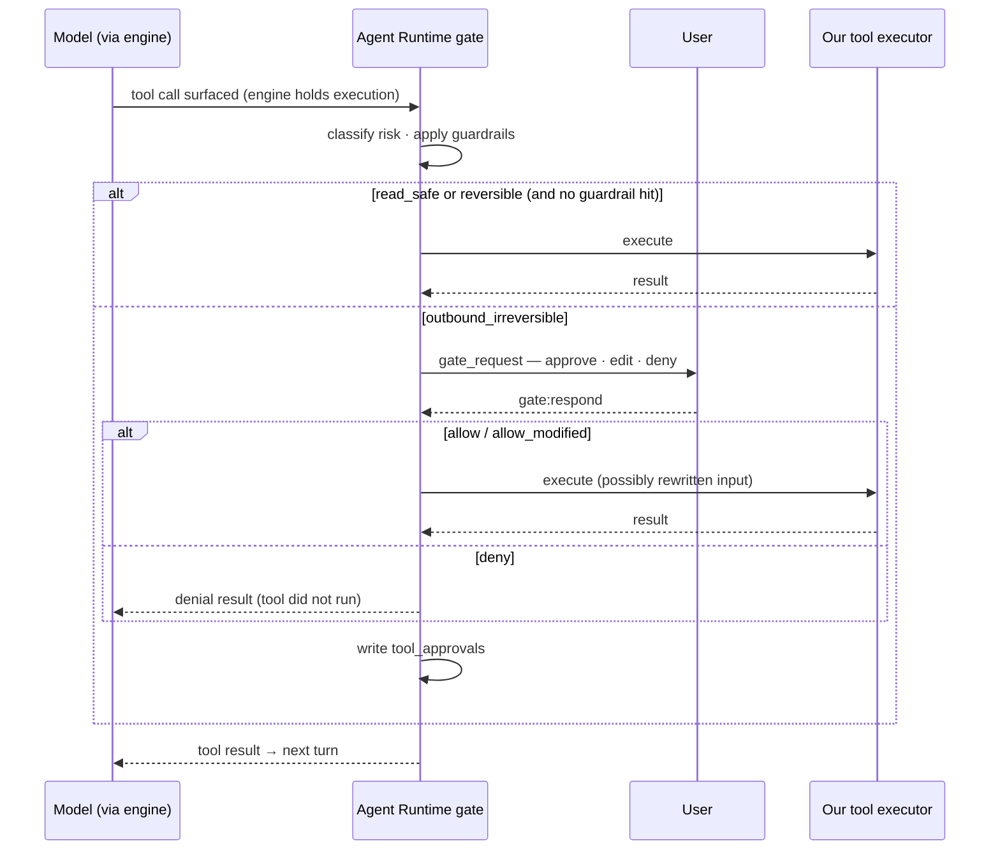

# Phase 2 — In-house Tools + HITL Approval Gate + Personalization Measurement

> Execution plan for Phase 2a and 2b. Product concept, architecture, and locked decisions live in [`personalized-agent-desktop-app`](../design/personalized-agent-desktop-app.md); the gate and engine contracts are in [`phase-1-contracts`](../interface/phase-1-contracts.md).

**Goal**: give the agent its **tools** and make acting with them safe and measurable. **2a** builds the in-house tool executors, upgrades Phase 1's minimal gate into a **risk-classified HITL approval gate**, adds deterministic guardrails, and records quantitative metrics — all in our provider-independent runtime. **2b** adds an **asynchronous LLM-as-judge** that scores "how much like me did it write," complementing the 2a metrics.

**Entry conditions** — carried from Phase 1:
- SPIKE-03 passed on **both engines**: in `AiSdkEngine` every tool call is surfaced execute-less to our loop; in the dev `ClaudeAgentSdkEngine` a `PreToolUse` hook fires on every call and its deny is authoritative. The gate is ours, attached per engine ([contracts](../interface/phase-1-contracts.md) §3).
- The runtime scaffold exists: the gate injection point, the engine interface, the MCP registry, and a **local SQLite store** (F1-05). The eval tables in §5 **extend that store** — they are not a new database.
- A minimal always-prompt gate already runs in Phase 1, so no tool has ever executed ungated. Phase 2 replaces its *decision logic*, not the contract.

---

## 1. Why this is the heart of the product

- It places a safety catch at the highest-risk point of "acting on my behalf" (autonomous outbound), while **verifying numerically** whether personalization is actually happening.
- In practice, "AI drafts → human clicks approve" sees near-universal acceptance, while "AI sends autonomously" is near-universally rejected — HITL is a precondition for landing in production [7].
- Academic memory benchmarks (LoCoMo and similar) measure "factual recall" and cannot measure "like me" → replaced with **real usage signals**.

## 2. Why the gate (2a) and the judge (2b) are separated

- The principle: **control and measurement are deterministic (our gate); judgment and generation belong to the LLM. Never let an LLM decide an irreversible action.**
- **The HITL gate and guardrails are deterministic code** — security controls needing a 100% guarantee, so they run as our own wrapper over every tool call, not as model judgment.
- **"Is this my voice?" is a nuanced judgment (2b)** — the gate cannot measure it, so a lightweight evaluation agent does, off the hot path.
- **2b runs asynchronously** — it scores logged draft→final pairs after the fact, never blocking the send path. Cost and latency are managed via batching and caching.
- Analogy: the gate is the "approval stamp and CCTV" (always identical); the judge is the "quality inspector" (samples and grades after the fact). Put the inspector in the approval chain and approvals become slow and inconsistent.

## 2.5 Where the gate lives (carried from the pivot)

The gate is **our code in the runtime**, defined once and attached at whichever engine's pre-execution point:

- **`AiSdkEngine` (prod)**: tools are execute-less; our loop holds each surfaced call, runs the gate, and only then runs our executor. Nothing auto-executes.
- **`ClaudeAgentSdkEngine` (dev/test)**: the gate is a `PreToolUse` hook whose deny is authoritative even under `bypassPermissions`; our tools are in-process MCP handlers.

Invariants that must hold (full list in [contracts](../interface/phase-1-contracts.md) §3): a tool never runs until the gate returns `allow`; `allow` may rewrite input with no TOCTOU window; **no auto-execution path may bypass the gate** (AI SDK MCP via `listTools()`/`callTool()`, never `tools()`; Agent SDK tools never in `allowedTools`; no provider-side server-executed tools); and if the gate cannot attach, the session refuses to start (`GATE_UNSOUND`). This replaces the earlier, Claude-Code-specific "use `PreToolUse` not `canUseTool`" correction — the lesson generalized once the engine became swappable: **the gate must sit where the model cannot reach past it, and we must own that point.**

---

## 3. Feature list

### 3.1 Phase 2a — tools, gate, guardrails, metrics (hot path, deterministic)

| ID | Feature | Description | Priority | Completion criteria |
|------|------|------|------|------|
| F2-00 | **In-house tool executors** | Build the tool set (which tools is an open question — §9) with per-OS sandboxing/path-scoping. Each executor is a provider-independent runtime function the engine calls back into | Must | The chosen tools run under the gate on all target OSes; sandboxing negative-tested |
| F2-01 | Tool risk classification | Tag each tool read-safe / reversible / outbound-irreversible in a policy file the gate reads | Must | Classification loads from the policy file |
| F2-02 | HITL approval gate (rich) | Upgrade the Phase 1 minimal gate: auto-allow read-safe/reversible; for outbound-irreversible emit `gate_request` → approve/edit/deny card → apply decision (`input` rewrite for allow-after-edit) | Must | Gate soundness regression passes on both engines; every outbound call is held for a human decision |
| F2-03 | Guardrail rules | Deterministically deny secret-file access, destructive shell, etc. before the human is even prompted | Must | Designated risky actions blocked without reaching the approval card |
| F2-04 | Eval event logger | Extend the Phase 1 SQLite store; record draft creation, user edits, final confirmation, and every gate decision | Must | Events land in SQLite |
| F2-05 | Quality dashboard | Approval rate, edit distance, override rate over time + per-session drill-down | Must | All three metrics visualized |
| F2-06 | Contamination isolation stub | Reserve a post-execution isolation slot (email/web content) for Phase 3 | Could | Entry point exists |

### 3.2 Phase 2b — asynchronous evaluation agent (judgment plane, off the hot path)

| ID | Feature | Description | Priority | Completion criteria |
|------|------|------|------|------|
| F2-07 | Evaluation agent (LLM-as-judge) | Score logged draft→final pairs **asynchronously and post hoc** (voice/personalization, 0–1). Never blocks the send path. Runs through the engine on a **chosen provider** | Should | A personalization score recorded per draft |
| F2-08 | Isolated judge context | Run scoring in an **isolated context** (a separate `engine.run` with its own message history) so it never contaminates the main conversation | Should | Main session context unchanged |
| F2-09 | Dashboard integration | Show deterministic metrics (2a) and judge scores (2b) **side by side** to surface correlation | Could | Both series displayed together |

- **A multi-provider strength**: the judge can run on a *different* provider than the drafting model — scoring Claude output with GPT or Gemini avoids the same-model blind spot. Which provider is an open question (§9).
- Execution: F2-07 runs on a **batch/low-load trigger**; identical draft/prompt pairs are cached to avoid re-scoring.

---

## 4. Personalization quality metric definitions

- **Approval Rate** = drafts approved as-is ÷ total drafts.
- **Edit Distance** = normalized change from draft to final (token diff or normalized Levenshtein). Lower = more "like me."
- **Override Rate** = proportion denied or heavily modified at the gate.
- **Personalization Score (2b)** = voice/tone match (0–1) from the judge over a draft→final pair. **Complements** the three deterministic metrics — never sole evidence, always reported alongside them.
- Analogy: record **how much you rewrite** the assistant's drafts each day (deterministic), while a separate inspector grades **whether the voice sounds like you** (2b). Less to fix + rising score = learning happened.

---

## 5. Data model (SQLite — extends the Phase 1 store)

Phase 1 already owns `userData/app.db` (sessions, transcripts, memory, MCP registry). Phase 2 **adds** these tables. Whether the database is encrypted at rest is sharpened here, because `eval_events` holds potentially sensitive draft/final text (§9).

```sql
-- Eval event: one draft→final record
CREATE TABLE eval_events (
  id            TEXT PRIMARY KEY,
  session_id    TEXT NOT NULL,
  domain        TEXT,            -- work / personal etc. (prep for Phase 3 isolation)
  task_type     TEXT,            -- email_reply, ideation, research ...
  draft         TEXT NOT NULL,   -- agent draft
  final         TEXT,            -- user's final version (on send/confirm)
  decision      TEXT NOT NULL,   -- approved | edited | denied
  edit_distance REAL,            -- normalized change 0–1 (deterministic, 2a)
  persona_score REAL,            -- personalization score 0–1 (LLM-judge, 2b, async)
  judge_provider TEXT,           -- which provider scored it (2b)
  scored_at     INTEGER,         -- 2b scoring timestamp (NULL if unscored)
  created_at    INTEGER NOT NULL
);

-- Approval gate log: per tool call
CREATE TABLE tool_approvals (
  id          TEXT PRIMARY KEY,
  session_id  TEXT NOT NULL,
  tool_name   TEXT NOT NULL,
  risk_class  TEXT NOT NULL,     -- read_safe | reversible | outbound_irreversible
  decision    TEXT NOT NULL,     -- allow | allow_modified | deny
  modified    INTEGER DEFAULT 0,
  created_at  INTEGER NOT NULL
);
```
* Source: original work (2026) — fields adjusted during implementation. Note `eval_events` is provider-independent except `judge_provider`, which records only who *scored*, not who drafted.

---

## 6. Approval gate flow (engine-agnostic)


* The flow is identical whichever engine is running — only *how* the call is surfaced differs (AI SDK execute-less vs Agent SDK `PreToolUse`).
* Source: original work (2026)

---

## 7. Definition of Done

- **2a**: the in-house tools run under the gate on all target OSes; outbound/destructive calls pass the **approval gate without exception** on both engines; guardrails **deterministically block** designated actions before prompting; **approval rate, edit distance, override rate** aggregated and visualized per session.
- **2b**: the judge **scores draft→final pairs asynchronously** and records a personalization score (and its scoring provider) **without delaying or blocking the send path**; the dashboard shows it alongside the deterministic metrics.

---

## 8. Phase 2 risks

- **Owning the tool layer** — building sandboxed executors is the largest new cost of the pivot and the place a security bug is most damaging. → A reduced, safe-by-construction tool set is preferred over a broad one; F2-00 sandboxing is negative-tested, not assumed.
- **Prompt injection** — email/web content the agent reads can become a command channel. → Outbound gate (F2-02) + post-execution isolation (F2-06 stub, full in Phase 3).
- **2b cost and nondeterminism** — LLM scoring adds calls, cost, variance. → Off the hot path, low-cost model, batching, caching. Judge scores **complement** the deterministic metrics; never a sole verdict.
- Cross-phase risks are in [`personalized-agent-desktop-app`](../design/personalized-agent-desktop-app.md) §4.

---

## 9. Phase 2 open questions

- **The tool set** — which executors ship (shell? file edit? web fetch?) and the sandboxing model per OS. The single biggest scoping decision the pivot introduces.
- Edit distance formula (token diff vs. normalized Levenshtein) — blocks F2-04.
- **2b judge**: scoring model/provider (a strength is scoring Claude output with a non-Claude model), cadence (batch vs. low-load trigger), and cost cap.
- Whether eval scoring needs its own cost cap, separate from interactive usage.
- Whether `app.db` (now holding draft/final text) requires **encryption at rest** — see [`personalized-agent-desktop-app`](../design/personalized-agent-desktop-app.md) §6.

---

## References

Numbering matches the canonical list in [`personalized-agent-desktop-app`](../design/personalized-agent-desktop-app.md).

3. Vercel (2026), AI SDK — Tool calling and tool approval, https://ai-sdk.dev/docs/ai-sdk-core/tools-and-tool-calling
7. Nitin (2026-05-05), Building a Customer Support Triage Agent with Claude — HITL acceptance, https://medium.com/@nitin_26346/building-a-customer-support-triage-agent-with-claude-a-walkthrough-89a812cc09bf
